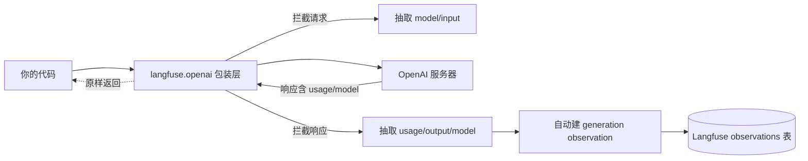
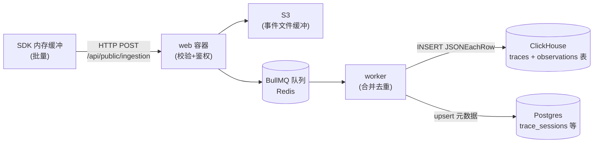
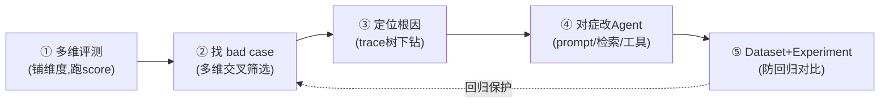

---
title: "Langfuse：给你的 Agent 装上行车记录仪"
author: ivanbao9783
date: 2026-07-15 15:10:05 +0800
categories: [技术笔记]
tags: [Agent评测, Langfuse, 可观测性]
description: Langfuse 给 Agent 装上行车记录仪：trace、span、observation 三层结构让你看透 Agent 的每一次决策。
---

---

## 1. 前言：Agent 开发者的"深夜噩耗"

每个做过 Agent 线上化的开发者，大概率都经历过这样的深夜告警：

- **"Agent 突然陷入死循环，在一个工具上反复调用 30 次，Token 烧掉几十刀。"**——但你不知道是哪个环节的判断逻辑出了问题。
- **"这次请求耗时 12 秒，上游超时熔断了。"**——但你不知道是 LLM 推理慢，还是检索慢，还是某个工具卡住了。
- **"LLM 返回了一段诡异的内容，下游解析器直接崩溃。"**——但你没存那次 LLM 的原始输入输出，无从复盘。

更绝望的是，这些事故往往**难以复现**。Agent 是黑盒：你只看到"进了一个请求，出了一个结果"，中间到底发生了什么——调了几次 LLM、用了什么 prompt、检索召回什么文档、工具返回什么——**全凭想象**。

这就是大模型可观测性（Observability）要解决的问题。而 **Langfuse**，就是给 Agent 装上的那台**行车记录仪**：它不替你开车，但全程录像；事故发生时，你能倒带、定位、复盘、改进。

本文不讲 Langfuse 的 UI 怎么点，只讲三件硬核的事：

1. 怎么用**最小侵入**的方式给 Agent 装上这台记录仪？
2. 这台记录仪内部是怎么工作的？它到底记录了什么、存在哪？
3. 拿到录像之后，怎么用它**驱动 Agent 评测与优化**，而不是只当"日志看"？

---

## 2. 如何快速挂载这台"记录仪"？

### 2.1 核心思想：只加，不改；只在边界加，不进内部

接入可观测性最大的顾虑是：**会不会把业务代码搞得面目全非？** Langfuse 的答案是——不用。

它的接入精髓是一句话：**用装饰器在函数外层贴膜，用包装层替换 import，用旁路调用登记评分。** 你的 Agent 业务逻辑一行不用改，评测逻辑一行不用改。把 Langfuse 相关调用全删掉，代码退回原始形态，Agent 照跑。

### 2.2 三行代码完成最小接入

```python
from langfuse.openai import openai          # ① 换 import：用包装版替代原生
from langfuse import Langfuse
from langfuse.decorators import observe, langfuse_context

langfuse = Langfuse()                        # ② 初始化（自动读环境变量）

@observe(name="gaia_agent")                  # ③ 贴装饰器：函数体不动
def react_agent(question, task_id):
    langfuse_context.update_current_trace(
        id=f"gaia-{task_id}",                # 自定义 trace_id，防错配
        metadata={"task_id": task_id},
    )
    for step in range(5):
        thought = openai.chat.completions.create(   # 调用方式完全不变
            model="gpt-4o",
            messages=[{"role": "user", "content": question}],
        ).choices[0].message.content
        if parse_action(thought) == "FINISH":
            break
        tool_call(parse_action(thought))
    return thought
```

**就这三处改动：换一个 import、初始化一次、贴一个装饰器。** Agent 的循环逻辑、LLM 调用方式、工具调用代码——一字未动。

### 2.3 为什么换一个 import 就能拿到 LLM 的全部细节？

这是很多人最困惑的点：`cost`、`tokens`、`model` 这些信息明明在 LLM 的请求响应里，Langfuse 怎么"自动采集"到的？难道是魔法？

**不是魔法，是拦截。** `from langfuse.openai import openai` 拿到的是一个**被包装过的 OpenAI 客户端**。当你调 `openai.chat.completions.create()` 时，包装层在请求出去前、响应回来后各"抄一笔"：



关键认知：**tokens 不是 Langfuse 算的，是 OpenAI 响应里本来就带的 `usage` 字段；cost 是 worker 用 tokens × 定价表派生的。** Langfuse 只是"顺手抄了一笔"，你的业务代码完全无感知。

如果你用的是非 OpenAI 模型（Anthropic、Gemini、自部署 vLLM），包装层覆盖不到，手动喂一下即可：

```python
@observe(as_type="generation")               # 声明这是 generation 节点
def llm_generate(question):
    resp = anthropic.Anthropic().messages.create(model="claude-3-5-sonnet", ...)
    # 手动把 Anthropic 响应里的 usage 喂给 Langfuse
    langfuse_context.update_current_observation(
        model=resp.model,
        usage={"input": resp.usage.input_tokens, "output": resp.usage.output_tokens},
    )
    return resp.content[0].text
```

**手动喂字段不限模型，任何 API 都能接。** 唯一例外是 cost——它是 worker 查定价表派生的，模型在表里才自动算；不在表里就去 UI 配价格，或干脆把 cost 当业务分手动 score。

### 2.4 最小侵入的三条铁律

| 铁律 | 做法 |
| --- | --- |
| 采集靠装饰器，不靠改函数体 | `@observe` 贴在函数外，函数内一行不动 |
| LLM 细节靠包装层，不靠手动埋 | 优先用 `langfuse.openai` 等集成；非 OpenAI 才手动喂 |
| 评测靠旁路登记，不靠替换逻辑 | 原有评测函数原封不动，结果算出后加 `langfuse.score` |

把所有 `langfuse.*` 调用删掉，Agent 和评测照常工作。这就是"可插拔"的含义。

---

## 3. 解剖行车记录仪——Trace 记录的底层原理

装是装上了，但这台记录仪到底记录了什么？数据怎么组织的？存在哪？这一部分拆开给你看。

### 3.1 Trace / Span / Generation / Event：四层嵌套关系

Langfuse 用一棵**执行树**来组织 Agent 的一次运行。树节点有四种类型：

| 节点类型 | 含义 | 典型场景 | 自动捕获字段 |
| --- | --- | --- | --- |
| **Trace** | 一次完整的 Agent 任务，树的根 | `react_agent()` 整个调用 | input/output/user_id/session_id/metadata |
| **Span** | 一个有起止时间的工作单元 | 检索知识、调用工具、规划步骤 | name/input/output/start_time/end_time/metadata |
| **Generation** | 一次 LLM 调用（span 的特化） | `openai.chat.completions.create()` | model/usage(tokens)/cost/input/output |
| **Event** | 无时长的时间点事件 | 记录一次工具调用的开始、一个中间状态 | name/input/output |

**层级关系是一棵树**：

```text
trace: gaia_agent (一次任务)
├─ span: 知识检索
│   └─ metadata: retrieved_docs=[...]
├─ generation: 答案生成 (一次 LLM 调用)
│   ├─ model: gpt-4o
│   ├─ usage: {input: 120, output: 80}
│   └─ cost: $0.002
├─ span: 工具调用
└─ event: 检索完成
```

**一次 Agent 运行 = 1 条 Trace + N 个子节点。** `trace_id` 是主键，所有子节点通过 `parent_observation_id` 挂到树上。

### 3.2 `@observe` 怎么自动建出这棵树？

装饰器不是魔法，它靠的是**线程本地的"观察栈"**。原理伪代码：

```python
# Langfuse SDK 内部简化原理
_observation_stack = threading.local()       # 线程本地栈

def observe(name=None, as_type="span"):
    def decorator(func):
        def wrapper(*args, **kwargs):
            stack = getattr(_observation_stack, "val", [])
            if not stack:
                # 栈空 → 顶层函数 → 创建新 Trace
                trace_id = str(uuid.uuid4())
                parent_id = None
            else:
                # 栈非空 → 嵌套调用 → 复用外层 trace_id，栈顶就是父亲
                trace_id  = stack[-1]["trace_id"]
                parent_id = stack[-1]["obs_id"]

            obs = {
                "id": str(uuid.uuid4()),
                "trace_id": trace_id,
                "parent_observation_id": parent_id,    # 父子关系靠这个
                "name": name or func.__name__,
                "input": serialize(args, kwargs),       # 自动捕获入参
                "start_time": time.time(),
            }
            stack.append({"trace_id": trace_id, "obs_id": obs["id"]})
            _observation_stack.val = stack

            try:
                output = func(*args, **kwargs)          # 业务逻辑照跑
                obs["output"] = serialize(output)       # 捕获返回值
            except Exception as e:
                obs["status"] = "error"                 # 自动捕获异常
                raise
            finally:
                obs["end_time"] = time.time()           # 捕获耗时
                stack.pop()                              # 出栈
            async_send(obs)                              # 异步发到 server
        return wrapper
    return decorator
```

**三个关键动作**：进函数前 push 栈 + 发"创建"事件；执行业务逻辑（完全不受影响）；出函数后 pop 栈 + 发"更新"事件（带返回值/异常/耗时）。**栈空就建 Trace，栈非空就当子节点。** 嵌套关系完全由调用栈自然决定，你不用手动指定父子。

### 3.3 数据流向：从内存到 ClickHouse 的异步落盘

采集到的事件不会同步写库（那样会拖慢 Agent），而是走一条**异步、批量、解耦**的写入链路：



**为什么这么设计？** Agent 的事件吞吐可能很高（一次任务几十个 observation）。如果同步写 ClickHouse，web 容器会被拖死。所以 Langfuse 把写路径拆成三段：

1. **web 只做校验 + 落 S3 + 入队**——轻量，扛得住高并发。
2. **S3 做缓冲**——削峰填谷，worker 跟不上时事件不丢。
3. **worker 做重活**——从 S3 拉取、合并去重、批量写 ClickHouse。

**终端真相在 ClickHouse 的宽表里**，S3/队列/Redis 都是中间缓冲。这也是 Langfuse 能扛高吞吐的根本原因。

### 3.4 各字段最终落到哪张表

| 字段类别 | 落到 ClickHouse 哪张表 | 关键字段 |
| --- | --- | --- |
| Trace 顶层信息 | `traces` | id, name, input, output, user_id, session_id, metadata |
| 执行树节点 | `observations` | id, trace_id, parent_observation_id, type, name, input, output, model, usage, cost_details, start_time, end_time, level |
| 评分 | `scores` | id, trace_id, name, value, data_type, source, comment |

**关联键是 `trace_id`**——`observations.trace_id` 和 `scores.trace_id` 都外键指向 `traces.id`。所以一条 Trace = 一棵执行树 + N 个评分，Dashboard 就是按 `trace_id` 把它们 JOIN 起来聚合的。

---

## 4. 从"看日志"到"搞评测"——Trace 如何赋能 Agent 评估

这是 Langfuse 最容易被低估的部分。很多人装完记录仪，就停在"看看 trace 树找 bug"的层面。**但 Trace 的真正价值，是让 Agent 评测从"只看对错"升级到"多维评测 + 反哺优化闭环"。**

### 4.1 痛点：1 维评测的天花板

绝大多数团队的 Agent 评测长这样：

```python
def gaia_exact_match(pred, gt):
    return normalize(pred) == normalize(gt)

for task in dataset:
    answer = agent(task["question"])
    is_correct = gaia_exact_match(answer, task["ground_truth"])
    # 然后呢？答错了不知道为什么，答对了不知道是不是蒙的
```

**1 维评测只能回答"对不对"，回答不了"为什么对/错"、"高效还是低效"、"有没有隐患"。** 答错一道题，你不知道是检索召回差、还是推理能力弱、还是工具实现有 bug。盲目换更强的模型？贵且未必有效。

### 4.2 关键认知：cost/latency/步数本身就是评测维度

很多人以为"cost、latency、tokens 只是运行时数据，不是评测"。**这是认知盲点。**

> **"这条 trace 花了 $0.5 跑对了一道 Level 1 题"——这就是一个效率维度的评价。**

trace 暴露的过程数据，本身就是评测维度。你要做的不是"发明新方法论"，而是**挑你关心的 trace 字段 + 定义规则/阈值 + 落成 score**。

### 4.3 多维评测体系设计

从 1 维扩展到多维，遵循一个原则：**按成本递增铺维度**。先用 trace 已有字段（零成本），再用规则派生（低成本），最后才用 LLM-as-judge（高成本）。

| 维度 | score 名 | data_type | 数据来源 | 成本 | 驱动的优化决策 |
| --- | --- | --- | --- | --- | --- |
| 结果 | `gaia_exact_match` | CATEGORICAL | trace.output vs ground_truth | 低（已有） | 整体准确率 |
| 效率 | `step_count` | NUMERIC | count(observations) | 零 | 减少无效循环 |
| 效率 | `total_cost` | NUMERIC | sum(cost_details) | 零 | 降本 |
| 效率 | `latency_ms` | NUMERIC | max(end)-min(start) | 零 | 降延迟 |
| 异常 | `has_error` | CATEGORICAL | any(level=ERROR) | 低 | 修 bug |
| 异常 | `has_loop` | CATEGORICAL | 检测重复工具调用 | 低 | 修死循环 |
| 路径 | `retrieval_relevance` | CATEGORICAL | LLM-as-judge | 高 | 改检索 |
| 路径 | `reasoning_quality` | CATEGORICAL | LLM-as-judge | 高 | 改推理 prompt |

### 4.4 `data_type`：决定分怎么存、怎么聚合

Langfuse 的 `score` 有个 `data_type` 字段，它不影响"分怎么算"，只影响"分怎么存、怎么聚合、怎么展示"：

| data_type | 存什么 | 能聚合？ | 典型用途 |
| --- | --- | --- | --- |
| `NUMERIC` | 连续数值 | ✅ mean/p50/p95 | 成本、延迟、步数 |
| `CATEGORICAL` | 离散类别 | ✅ 各类别占比 | exact match(correct/incorrect)、评级 |
| `BOOLEAN` | true/false | ✅ true 占比 | 通过/不通过 |
| `CORRECTION` | 正确答案 | ❌ 不可聚合 | 答错时记录"本该是什么" |

> 注意：**`langfuse.score` 不是"评判器"，它是"成绩登记员"。** 它不算分，只把你算好的分存档。你的 `gaia_exact_match` 该怎么算还怎么算，Langfuse 不插手。把 `langfuse.score` 这行删掉，评测照常出分——只是那分跟 Trace 失联了，没法在 Dashboard 聚合看。

### 4.5 多维评测代码：在原有评测外层包一圈

```python
from langfuse import Langfuse
langfuse = Langfuse()

def gaia_exact_match(pred, gt):           # 原评测逻辑，一字不动
    return normalize(pred) == normalize(gt)

def has_repeated_tool_calls(observations):
    """检测死循环：同一工具+同一参数被调多次"""
    seen = set()
    for obs in observations:
        key = (obs.name, str(obs.input)[:100])
        if key in seen:
            return True
        seen.add(key)
    return False

for pred in predictions:                  # predictions 含 task_id, trace_id, answer
    trace_id = pred["trace_id"]
    trace = langfuse.fetch_trace(trace_id)
    obs_list = trace.observations

    # ① 结果维度（原有）
    is_correct = gaia_exact_match(pred["answer"], lookup_gt(pred["task_id"]))
    langfuse.score(trace_id, "gaia_exact_match",
        "correct" if is_correct else "incorrect", "CATEGORICAL")

    # ② 效率维度（trace 字段派生，零成本）
    langfuse.score(trace_id, "step_count", len(obs_list), "NUMERIC")
    langfuse.score(trace_id, "total_cost",
        sum(o.usage.get("cost", 0) for o in obs_list if o.usage), "NUMERIC")

    # ③ 异常维度（规则派生，低成本）
    langfuse.score(trace_id, "has_error",
        "yes" if any(o.level == "ERROR" for o in obs_list) else "no", "CATEGORICAL")
    langfuse.score(trace_id, "has_loop",
        "yes" if has_repeated_tool_calls(obs_list) else "no", "CATEGORICAL")

    # ④ 答错时存正确答案（CORRECTION，不可聚合但能回看）
    if not is_correct:
        langfuse.score(trace_id, "output", lookup_gt(pred["task_id"]), "CORRECTION")

    langfuse.flush()
```

**改造量：原有 `gaia_exact_match` 一字不动，只是在外层多加了几行 score。** 这就是从 1 维到多维的全部改造成本。

### 4.6 反哺优化闭环：从"评"到"改"的 PDCA

拿到多维 score 后，真正的价值在于**驱动优化**。闭环五步：



**第②步的关键：bad case 不只是"答错的题"。** 多维视角下，有四类值得优化的 case：

| 类别 | 筛选条件 | 优先级 | 为什么值得修 |
| --- | --- | --- | --- |
| 错且贵 | exact_match=incorrect AND cost>阈值 | 🔴 最高 | 既错又烧钱，双输 |
| 错且有报错 | exact_match=incorrect AND has_error=yes | 🔴 高 | 有明确 bug，根因清晰 |
| 对但低效 | exact_match=correct AND step_count>阈值 | 🟡 中 | 答对了但绕远路，降本空间 |
| 对但检索差 | exact_match=correct AND retrieval_relevance=low | 🟡 中 | **侥幸答对**，换题就崩，隐患 |

**第③步：trace 树下钻定位根因。** 在 Langfuse UI 点开一条 bad case 的 trace，看执行树：

```text
trace: gaia-task-042  (exact_match=incorrect, cost=$0.4, step_count=8)
├─ span: 知识检索
│   └─ metadata: retrieved_docs=["2020东京奥运...", "日本奖牌总数..."]
│                                    ↑ 文档时间错了！2020 vs 2024
├─ generation: llm_think#1     基于错误文档推理
├─ span: tool_call(search)     又搜了，但带了 2020 偏见
├─ ... (重复搜索 4 次，死循环倾向)
└─ generation: llm_final       输出 "25" (错，正解 20)
```

**根因定位**：第 2 步检索返回了 2020 东京奥运的文档（时间错误）→ 后续推理全部基于错误前提 → 答错。**根因是检索的 query 生成没带年份约束，不是推理能力差。**

**第④步：对症下药。**

| 根因 | 改什么 | 怎么改 |
| --- | --- | --- |
| 检索 query 没带年份 | 改 query 生成 prompt | 加约束"提取问题中的时间范围，写入检索 query" |
| 检索召回差 | 换 embedding / 加 rerank | 用更好的 embedding，或加 cross-encoder rerank |
| 推理跑偏 | 改 ReAct prompt 模板 | 加 few-shot 示范"先验证检索结果时效性" |
| 死循环 | 加循环检测 | 重复工具调用 >2 次强制 FINISH |

**1 维评测只能告诉你"换 GPT-4o 试试"（贵且无效）；多维评测告诉你"改检索 query 这一行 prompt"（精准且便宜）。**

**第⑤步：沉淀 Dataset + Experiment 对比，防回归。** 改完后最怕"修好这题、弄坏那题"。把修过的 bad case 固化成回归测试集，改完 prompt 在 Dataset 上重跑，新旧多维 score 并排对比——不只是看 accuracy 有没有升，还要看 cost/step_count 有没有降，避免"accuracy 升了但成本翻倍"的伪优化。

### 4.7 离线 vs 在线：维度不变，触发方式不同

| | 离线（GAIA benchmark） | 在线（线上 Agent） |
| --- | --- | --- |
| 触发 | 你跑批量脚本，手动 `langfuse.score` | 新 trace 落地，worker 自动触发 |
| 评测逻辑在哪 | 你的 Python 代码 | Langfuse 配置（LLM 裁判 prompt / 代码片段） |
| 评测维度 | 多维全可做 | 同样多维全可做 |
| 适合 | 离线 benchmark、版本对比 | 线上监控、回归发现 |

在线化的本质：把"你代码里的评测函数 + 阈值规则"搬到 Langfuse 的"评估作业"配置里，worker 在新 trace 落地后自动跑评测器、自动打分。链路是 `IngestionService → TraceUpsert → CreateEval → EvaluationExecution → 裁判/代码 → scores 表`。你的 Agent 代码依然零修改。

---

## 5. 总结与避坑指南

**一句话升华**：Langfuse 不是"又一个日志工具"，它是 Agent 工业化落地的**闭环基础设施**——它让 Agent 从"只能看结果"变成"全程可复盘"，让评测从"只判对错"变成"定位根因"，让优化从"盲目调参"变成"对症下药"。没有可观测性的 Agent，永远停在 demo 阶段；有可观测性的 Agent，才具备迭代演进的可能。

**避坑速查**：

- **别每个函数都加 `@observe`**——只在决策边界（LLM 调用、工具、检索）加，纯工具函数是噪音。
- **LLM 调用必须标 `as_type="generation"`**——否则拿不到 usage/cost。
- **cost 不是采集的，是 worker 查定价表派生的**——模型不在表里就为空，去 UI 配价格。
- **节点数 ≠ Agent step**——节点数由埋点粒度决定，Agent step 是循环迭代数，两者不必然相等。
- **`langfuse.score` 不算分，只存分**——你的评测逻辑该咋写咋写，Langfuse 只负责存档关联。
- **分离式评测用业务 id 自定义 trace_id**——`update_current_trace(id=f"gaia-{task_id}")`，从机制上杜绝错配。
- **第三方黑盒 Agent 优先用 OTel**——零代码最全；不支持就解析事件流（stream-json）；再不行才包装入口只看进出。

---
