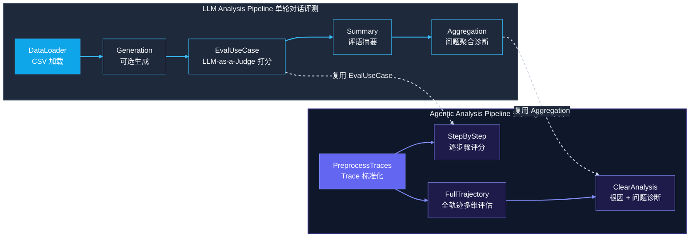

---
title: "LLM-as-a-Judge 不是银弹：拆解 IBM CLEAR 如何给 AI Agent 做全身体检"
author: ivanbao9783
date: 2026-07-15 15:10:05 +0800
categories: [技术笔记]
tags: [Agent评测, LLM-as-a-Judge, IBM CLEAR]
description: LLM-as-a-Judge 不是银弹：拆解 IBM CLEAR 框架如何给 AI Agent 做全身体检。
---

> 从"能跑就行"到"量化诊断"——一个开源的企业级 Agent 事后审计框架深度解读

⏱️ 阅读时间：约 10 分钟

***

## 📋 读完你将了解

- [x] 为什么传统评测手段无法诊断多步 AI Agent 的"暗病"
- [x] CLEAR 双管道架构的设计哲学：LLM Analysis 与 Agentic Analysis 的本质区别
- [x] 6 种 LLM-as-a-Judge 评判策略如何做到"一题一策"，以及背后的策略模式实现
- [x] Aggregation 三步走（提炼→去重→映射）如何从海量评语中自动提炼系统级缺陷
- [x] 一条完整的 Agent Trace 从 JSON 到诊断报告的全流程数据解剖
- [x] 5 分钟上手实操：安装、配置、跑通第一条评测管道

***

## 一、那个莫名其妙挂掉的 Agent

你花了两周搭建的 Code Agent，在本地 Demo 跑得风生水起。

推到测试环境 100 条真实任务，挂了 23 条。你翻着几千行的 Trace 日志，眼睛发酸，最终得出结论——"幻觉了"。

**但"幻觉了"这三个字，够你写复盘报告吗？**

你没法回答以下任何一个问题：是哪个步骤开始出错的？工具选对了吗？参数合理吗？分析了问题但写错了补丁？还是补丁正确但测试不通过？

更致命的是——这些问题之间有模式吗？还是纯属随机个例？

这就是当前 AI Agent 工程化的核心尴尬：我们有能力把 Agent 跑起来，却没有任何系统手段去**诊断它怎么就挂了**。

IBM 开源的 CLEAR（Comprehensive LLM Evaluation & Analysis Resource）正是为这个尴尬而生。

> **核心铁律：**
> CLEAR 不是一个"打分框架"，而是一个"事后审计系统"。它的目标不是告诉你 Agent 好不好，而是告诉你——**哪里不好、为什么不好、有没有规律。**

***

## 二、两条流水线，两种哲学

CLEAR 的设计有一个非常显性的特征：它把评测拆成了两条完全独立的管道。

这不是过度设计，而是对"单一 LLM 调用"和"多步 Agent 推理"这两种场景本质差异的诚实面对。

### 2.1 先看全貌：CLEAR 四层架构

在深入两条管道之前，先建立全局认知。CLEAR 采用清晰的分层设计：


### 2.2 双管道对比



下面这张表看得会更清楚：

| 维度       | LLM Analysis                      | Agentic Analysis                                      |
| -------- | --------------------------------- | ----------------------------------------------------- |
| **评测对象** | 单一 LLM 调用的一问一答                    | 多步 Agent 的完整执行轨迹                                      |
| **输入数据** | CSV（问题 + 回答 + 参考答案）               | JSON Trace（来自 MLflow/Langfuse）                        |
| **评测粒度** | 逐条记录                              | 逐步骤 + 全轨迹                                             |
| **核心能力** | 打分 + 问题聚合                         | 打分 + 步骤诊断 + 根因分析                                      |
| **评判维度** | 3 维（Adherence/Accuracy/Coherence） | 4 维（Correctness/Completeness/Relevance/ToolSelection） |
| **经典场景** | 评测翻译质量、数学解题、RAG 问答                | 评测 Code Agent、Tool-Use Agent、多智能体协作                   |

> **一句话区分：**
> LLM Analysis 回答的是"这句话翻译得对不对"，Agentic Analysis 回答的是"这个程序员从接需求到交代码，每一步做得怎么样"。

为什么要拆成两条管道？因为**评测逻辑根本不一样**。

单一 LLM 调用，你只需要看输入和输出——它回答了什么、对不对。但 Agent 的一次任务涉及多轮 LLM 调用和多次工具操作。`issue_analyzer` 分析对了但 `code_writer` 写错了，整个任务就挂了——你只盯着最终结果打分，等于给一个团队打绩效只看交付物不看过程。

**CLEAR 的设计答案很清晰：把过程还给评测。**

***

管道是骨架，但骨架再漂亮也回答不了一个核心问题 —— **谁来做裁判，又该怎么判？**

***

## 三、裁判的六副面孔：LLM-as-a-Judge 怎么做到一题一策

聊到评测，绕不开一个核心命题——**谁来做裁判？**

CLEAR 的回答是"大模型当裁判"（LLM-as-a-Judge）。但这四个字已经被说烂了，大部分人理解的 LLM-as-a-Judge 就是：

> "你帮我看看这个人回答得好不好，打个分。"

CLEAR 的不同在于：它把"打分"这个动作拆成了六种完全不同的裁判逻辑。

### 3.1 六种 Use Case 一览

每种 Use Case 有自己的 Prompt 模板、自己的评分维度、自己的解析方式：

| Use Case         | 核心评判逻辑            | 典型 Prompt 指令                                                             |
| ---------------- | ----------------- | ------------------------------------------------------------------------ |
| **MathEval**     | 最终答案错误 → 最高 0.5 分 | "If the final answer is wrong, score cannot exceed 0.5"                  |
| **RAGEval**      | 答案必须有检索文档支撑       | "Does the response faithfully reflect the provided documents?"           |
| **GeneralEval**  | 完全灵活的自定义标准        | 用户通过 `evaluation_criteria` 自定义任意维度                                       |
| **AgentEval**    | 区分"思考"和"工具调用"     | "Separately assess reasoning quality and tool selection appropriateness" |
| **ToolCallEval** | SPARC 二元判定        | "Was the correct tool selected? Were parameters correct?"                |
| **External**     | 完全自定义 Judge       | 接入外部评分服务或自定义逻辑                                                           |

**这六种 Use Case 之间不是"换个 Prompt"的关系，而是彻底的策略模式实现。**

CLEAR 的 `get_task_data_obj()` 工厂函数根据你的 `--task math` 或 `--task rag`，返回完全不同的 `EvalUseCase` 子类对象。来看一眼它核心的实现骨架：

```python
# CLEAR 的策略模式：一套接口，六种实现
def get_task_data_obj(use_case_name: str) -> EvalUseCase:
    """工厂函数：根据名称返回对应的评判策略"""
    task_map = {
        "math":      MathUseCase,        # 数学：答案错误 → 上限 0.5
        "rag":       RAGUseCase,         # RAG：基于文档自洽性
        "general":   GeneralEvalUseCase, # 通用：完全自定义维度
        "agent":     AgentEvalUseCase,   # Agent：区分推理与工具调用
        "tool_call": ToolCallEvalUseCase,# 工具调用：SPARC 二元判定
        "external":  ExternalJudgeUseCase# 外部：接入自定义裁判
    }
    if use_case_name not in task_map:
        raise ValueError(f"Unknown use case: {use_case_name}")
    return task_map[use_case_name]()

# 每个子类重写自己的 Prompt 构建逻辑
class MathUseCase(EvalUseCase):
    def generate_evaluation_model_prompt(self, row) -> str:
        # 数学专属 Prompt：强调最终答案校验 + 推理步骤检查
        return f"""Evaluate this math solution...
        Rule: If final answer is incorrect, score ≤ 0.5
        Question: {row['question']}
        Response: {row['response']}
        Reference: {row.get('reference', 'N/A')}"""
```

> **设计要点：** 不是 pipeline 里塞一堆 `if-else`，也不是一个万能 Prompt 打天下。每种任务有独立的 Prompt 模板和评分解析器，新增一种评测类型只需写一个新子类——这就是策略模式在评测系统中的经典应用。

### 3.2 一个 MathEval 的完整判例

来看一个具体的案例：

```text
输入问题： 一个水池，进水管 3 小时注满，出水管 5 小时放完，同时开几小时注满？
模型回答： 2 小时
标准答案： 15/2 小时（即 7.5 小时）
```

如果你用规则匹配——"2小时"不等于"15/2小时"——判错，但毫无诊断价值。

CLEAR 的 MathEval Judge 会输出：

```text
Evaluation score: 0.2

模型回答"2小时"完全错误。正确解法：
净流速 = 1/3 - 1/5 = 2/15 池/小时
时间 = 15/2 = 7.5 小时

问题诊断：
1. 缺乏任何推理步骤展示
2. 计算结果错误（可能犯了 5-3=2 的直觉错误）
3. 未展示对"净流速"概念的理解
```

**打分 + 诊断，一箭双雕。** 分数 0.2 告诉你这条记录有问题，评语告诉你问题是什么——后续的 Aggregation 模块就能从成百上千条这样的评语中提炼出系统级的缺陷模式。

> 💬 **你的 Agent 踩过类似的坑吗？** 遇到过"推理过程全对但工具调用选错了"的情况吗？评论区聊聊。

***

## 四、从打分到诊断的最后一公里：Aggregation 三步走

打分不难，难的是——打了 1000 条记录的分，你得到了一堆数字和评语文档，然后呢？

这就是 CLEAR 的 Stage 4 要做的事。它的核心流程是三步：

```mermaid
%%{init: {
  'theme': 'base',
  'themeVariables': {
    'background': '#0f172a',
    'primaryColor': '#1e293b',
    'primaryTextColor': '#f8fafc',
    'primaryBorderColor': '#38bdf8',
    'lineColor': '#64748b',
    'secondaryColor': '#1e1b4b',
    'tertiaryColor': '#0f172a',
    'edgeLabelBackground': '#1e293b'
  }
}}%%
graph LR
    subgraph INPUT["输入"]
        C1[评测结果 DataFrame<br/>score + evaluation_text]
    end

    subgraph STEP1["Step 1: Synthesize 提炼"]
        S1[分批发送评语给 LLM<br/>提取共性缺陷]
    end

    subgraph STEP2["Step 2: Deduplicate 去重"]
        S2[LLM 合并重复问题<br/>保留不同主题]
    end

    subgraph STEP3["Step 3: Map 映射"]
        S3[逐条记录二分类<br/>命中 / 未命中每个缺陷]
    end

    subgraph OUTPUT["输出"]
        C2[系统级缺陷列表<br/>+ 每条记录的问题画像]
    end

    C1 --> S1 --> S2 --> S3 --> C2

    %% 审美细节优化微调
    style INPUT fill:#1e293b,stroke:#334155,stroke-width:2px,color:#f8fafc
    style STEP1 fill:#1e293b,stroke:#334155,stroke-width:2px,color:#f8fafc
    style STEP2 fill:#1e293b,stroke:#334155,stroke-width:2px,color:#f8fafc
    style STEP3 fill:#1e293b,stroke:#334155,stroke-width:2px,color:#f8fafc
    style OUTPUT fill:#0f172a,stroke:#312e81,stroke-width:2px,color:#f8fafc

    style C1 fill:#0ea5e9,stroke:#38bdf8,stroke-width:1px,color:#ffffff
    style S1 fill:#1e293b,stroke:#38bdf8,stroke-width:1px,color:#f8fafc
    style S2 fill:#1e293b,stroke:#38bdf8,stroke-width:1px,color:#f8fafc
    style S3 fill:#1e293b,stroke:#38bdf8,stroke-width:1px,color:#f8fafc
    style C2 fill:#6366f1,stroke:#818cf8,stroke-width:1px,color:#ffffff

    linkStyle 0,1,2,3 stroke:#38bdf8,stroke-width:2px;
```



### Step 1 — Synthesize（提炼）

把成百上千条评测文本分批喂给 LLM，让它从海量评语中提炼共性缺陷。

这里有一个非常巧妙的设计——**加权采样**：

```python
weights = (1 - score) ** 4
```

高分记录不会被送进去提炼问题——已经答对了，不需要诊断。低分记录的权重呈四次方放大，确保**真正的缺陷被充分暴露**。

> **设计的巧思：** 四次方而不是线性加权，意味着一个 0.1 分的记录被采样概率是一个 0.5 分记录的约 30 倍。问题越严重的样本，越应该被"解剖"。

> 💬 **你觉得四次方够激进吗？** 如果换成六次方，会不会漏掉那些"勉强及格"的边界案例？

### Step 2 — Deduplicate（去重）

提炼出的缺陷列表中，大量问题是同一主题的不同表述。比如说：

- "缺乏推理步骤展示"
- "没有展示计算过程"
- "直接给答案无推理"

这三个本质上是在说同一件事。LLM 会做语义去重：几乎相同 → 合并，同一主题不同方面 → 保留，同一主题但相反观点 → 保留（如"过于冗长"和"不够详细"这对矛盾本身就值得深究）。

### Step 3 — Map（映射）

去重后的缺陷列表，每条都回溯到原始记录上做二分类——这条记录命中这个缺陷吗？

最终的输出不再是一个孤零零的分数，而是一份完整的问题画像：

```text
系统级缺陷：
  1. 缺乏推理步骤展示  → 命中了 47% 的记录
  2. 计算逻辑错误      → 命中了 23% 的记录
  3. 题意理解偏差      → 命中了 12% 的记录

单条记录画像（row_42）：
  - score: 0.2
  - 命中缺陷: [1, 2, 3]  ← 全部 3 个缺陷都命中了
  - 建议：重点加强净流速概念教学和多步骤推理训练
```

**这就是 CLEAR 的竞争力——你不再需要从几千条日志中人工归纳问题模式。**

这套 Aggregation 逻辑同样复用于 Agentic Analysis 的 `ClearAnalysis` 阶段：`root_cause_clear_runner` 分析"为什么任务失败"，`issues_clear_runner` 提炼"系统层面有什么共性问题"，底层调用的仍然是 `synthesize_shortcomings()` → `remove_duplicates_shortcomings()` → `map_shortcomings_to_records()` 这一套。

***

## 五、一条 Trace 的全流程解剖：从 JSON 到诊断报告

前面讲的都是 LLM Analysis 的套路，但 CLEAR 真正的杀手锏在 Agentic Analysis。

让我们追踪一条真实的 Agent Trace，看它如何从一团 JSON 变成一份可操作的诊断报告。

### 5.1 输入：来自 Langfuse 的原始 Trace

假设你的 Code Agent 执行了一次"修复空指针异常"的任务，Langfuse 记录的 Trace 长这样：

```json
{
  "id": "tr-abc123",
  "name": "code_fix_agent",
  "userId": "dev-team",
  "observations": [
    {
      "id": "obs-001",
      "name": "issue_analyzer",
      "type": "GENERATION",
      "input": "修复这个空指针异常...",
      "output": "问题出在 utils.py 第42行，需要加空值检查",
      "startTime": "2024-01-15T10:00:00Z",
      "endTime": "2024-01-15T10:00:05Z"
    },
    {
      "id": "obs-002",
      "name": "file_reader",
      "type": "SPAN",
      "input": {"file_path": "utils.py"},
      "output": {"content": "def process(x):\n    return x.strip()"},
      "parentObservationId": "obs-001",
      "startTime": "2024-01-15T10:00:05Z",
      "endTime": "2024-01-15T10:00:06Z"
    },
    {
      "id": "obs-003",
      "name": "code_writer",
      "type": "GENERATION",
      "input": "根据分析写补丁...",
      "output": "将第42行改为 if x is not None: return x.strip()",
      "parentObservationId": "obs-001",
      "startTime": "2024-01-15T10:00:06Z",
      "endTime": "2024-01-15T10:00:10Z"
    }
  ]
}
```

一团嵌套的 JSON，根本无法直接评测。

### 5.2 阶段 1：PreprocessTraces — 适配器模式标准化

CLEAR 的 `get_extractor()` 根据你的 Agent 框架（LangGraph / CrewAI）和可观测性平台（MLflow / Langfuse）自动选择合适的解析器，将异构 Trace 转为统一 Schema：

```csv
Name,          intent,         task_id,   step_in_trace, model_input,              response,                        tool_or_agent
issue_analyzer,修复空指针异常,  tr-abc123, 分析问题,      修复这个空指针异常...,      问题出在 utils.py 第42行...,       issue_analyzer
code_writer,   修复空指针异常,  tr-abc123, 编写补丁,      根据分析写补丁...,          将第42行改为 if x is not None...,  code_writer
```

> **设计亮点：** 无论你用 LangGraph + MLflow 还是 CrewAI + Langfuse，最终都收敛到同一张 CSV。这就是适配器模式在评测系统中的典型落地——上层评测逻辑完全不需要感知底层框架差异。

### 5.3 阶段 2：StepByStep — 逐步骤穿透评测

转换后的 CSV 按 `Name`（Agent 节点名）分组，每个节点独立跑一轮 LLM Analysis。

`issue_analyzer` 节点使用 **AgentEval**（4 维度：Correctness / Completeness / Relevance / Tool Selection），而 `code_writer` 同样使用 AgentEval 但评测上下文不同——它在评估"修复方案的正确性"而非"问题分析的准确性"。

每个节点产出独立的 `results.parquet` + `issues.json`：

```text
issue_analyzer 节点诊断结果：
  - 平均分: 0.85（分析质量较高）
  - 系统性问题: "偶尔遗漏边界条件分析"

code_writer 节点诊断结果：
  - 平均分: 0.62（修复质量有待提升）
  - 系统性问题: "在 73% 的案例中跳过了必要的空值检查"
```

### 5.4 阶段 3：FullTrajectory + ClearAnalysis — 全局视角诊断

逐步骤评测只能告诉你"各环节表现如何"，但回答不了"这个任务整体算成功吗"。

FullTrajectory 用 14 个维度（9 个步骤级 + 5 个轨迹级）对整条轨迹做全局打分，ClearAnalysis 再基于失败案例跑一轮 Aggregation 三步走：

```text
系统级根因（Root Cause）：
  1. code_writer 空值检查遗漏 → 命中 73% 的失败轨迹
     → 建议：在 system prompt 中增加强制空值检查指令
  2. issue_analyzer 边界条件遗漏 → 命中 28% 的失败轨迹
     → 建议：增加边界条件分析的 few-shot 示例
```

**从一团 JSON 到"哪个节点、什么问题、怎么修"，CLEAR 给出了完整的诊断闭环。**

***

## 六、不止是评测，更是工程体系的一环

聊到这里，CLEAR 的设计哲学已经非常清晰了。

它跟传统评测工具最大的区别在于：传统工具追求的是"给一个分数"，CLEAR 追求的是"给一份体检报告"。

分数 → 诊断 → 归因 → 改进，这四个环节缺一不可。

### 6.1 工程底座的扎实铺垫

为了支撑大规模评测，CLEAR 在工程上做了大量扎实的铺垫。

推理后端通过工厂模式统一管理三种实现——`LangChain` 适配自建 WatsonX 服务，`LiteLLM` 对接 100+ 第三方 API，`Endpoint` 连接内部 HTTP 推理节点。

并发执行层用 `ThreadPoolExecutor` 处理同步调用，`asyncio` 处理异步调用，统一收敛到 `run_parallel()` 接口——调用方不需要感知底层是线程池还是事件循环。

配置管理采用三层合并策略——默认 YAML 提供基础值，用户 YAML 按需覆盖，CLI 参数作为最高优先级。多级 CSV Checkpoint 缓存则保障了数小时的评测任务中断后可从断点恢复。

结果存储选用 Parquet 格式配合 Brotli 压缩，比传统 CSV 效率高 5-10 倍。

### 6.2 竞品生态中的定位

但工程细节终究是"器"，真正让 CLEAR 有价值的是它的"道"——**可操作性的诊断结果**。放在整个 Agent 评测生态中看：

| 能力维度            | CLEAR                                | DeepEval | Ragas        | LangSmith Eval  |
| --------------- | ------------------------------------ | -------- | ------------ | --------------- |
| **单轮 LLM 评测**   | ✅ 6 种 Use Case                       | ✅ 通用指标   | ✅ RAG 专项     | ✅ 自定义评估器        |
| **多步 Agent 评测** | ✅ StepByStep + FullTrajectory        | ❌ 不原生支持  | ❌ 仅 RAG 管道   | ✅ Trace 级评估     |
| **根因分析**        | ✅ Aggregation 三步走                    | ❌        | ❌            | ⚠️ 需手动配置        |
| **异构 Trace 兼容** | ✅ LangGraph/CrewAI + MLflow/Langfuse | ❌        | ❌            | ✅ LangSmith 生态内 |
| **断点续评**        | ✅ 多级 CSV Checkpoint                  | ❌        | ❌            | ✅               |
| **开源自部署**       | ✅ Apache 2.0                         | ✅ MIT    | ✅ Apache 2.0 | ❌ SaaS 为主       |

> **CLEAR 的核心不可替代性：** 它是目前唯一一个把"逐步骤诊断 → 问题聚合 → 根因映射"做成完整自动化闭环的开源工具。

***

## 🚀 5 分钟快速体验

下面是 CLEAR 的最小可运行路径：

### 环境准备

```bash
# 完整安装（含 Dashboard 和 Agentic Analysis）
pip install "clear-eval[all]"

# 配置 LLM Provider（以 OpenAI 为例）
export OPENAI_API_KEY="sk-xxx"
```

### 场景一：评测已有的模型回答

准备一个 CSV 文件 `data/my_eval.csv`：

```csv
model_input,response
"What is the capital of France?","Paris"
"Solve 2x + 5 = 15","x = 5"
```

一行命令跑通 LLM Analysis 全管道：

```bash
run-clear-eval-analysis \
    --data-path data/my_eval.csv \
    --results-dir results \
    --task general \
    --eval-model-name gpt-4o \
    --provider openai
```

输出：`results/analysis_results_my_eval_gpt_4o.zip` — 包含完整评测结果和诊断报告。

### 场景二：Agentic Analysis 评测

```bash
run-clear-agentic-eval \
    --traces-dir ./mlflow_traces \
    --results-dir ./results \
    --agent-framework langgraph \
    --observability langfuse \
    --run-step-by-step true \
    --run-full-trajectory true
```

### 场景三：仅运行聚合分析（已有评测结果）

```bash
run-clear-eval-analysis \
    --aggregation-only true \
    --data-path results/checkpoint_my_eval_gpt_4o.csv \
    --results-dir results \
    --task general \
    --eval-model-name gpt-4o \
    --provider openai
```

> 📦 完整配置参考与更多使用场景，见 [CLEAR GitHub 仓库](https://github.com/ibm/clear)。

***

## 🏁 总结

CLEAR 代表了 AI Agent 评测领域的一个趋势：从"能不能用"走向"怎么才能更好用"。

它不是一个 Demo 级别的玩具框架，而是一个有清晰分层架构、有策略模式驱动的 Use Case 体系、有工程化断点续评和并行执行底座的生产级工具。

但一个值得思考的问题是：当 AI Agent 的行为复杂到一定程度，LLM-as-a-Judge 的裁判本身会不会也出现系统性的偏见？我们是否需要一个"评价裁判的裁判"？

欢迎各位在评论区聊聊你的看法——你的 Agent 评测踩过什么坑？你觉得"裁判偏见"该怎么解决？
