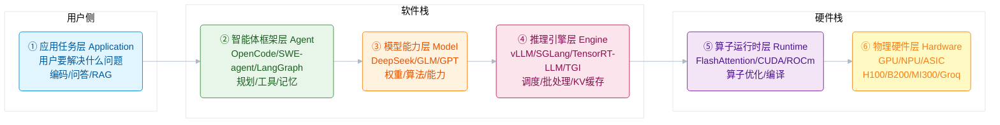
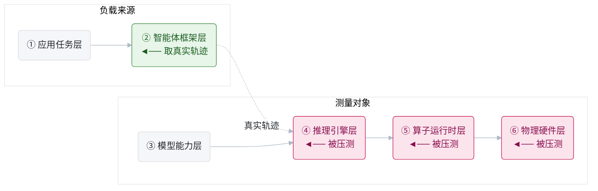
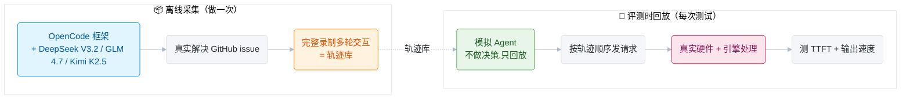
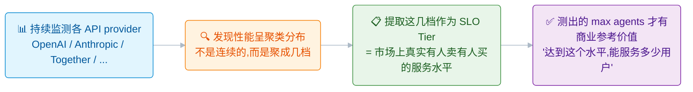
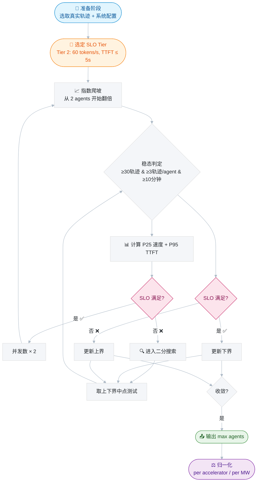
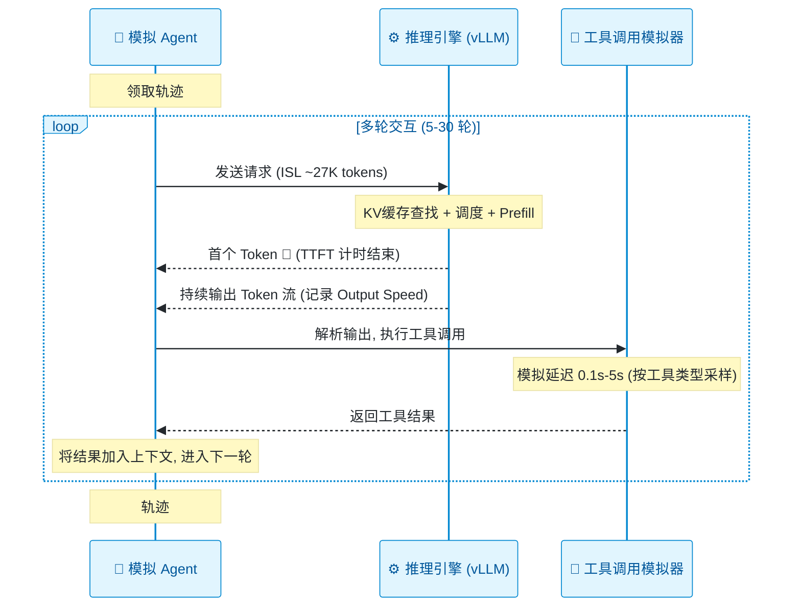
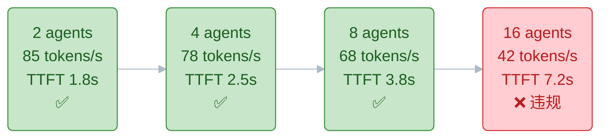
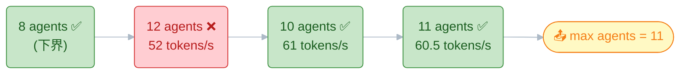
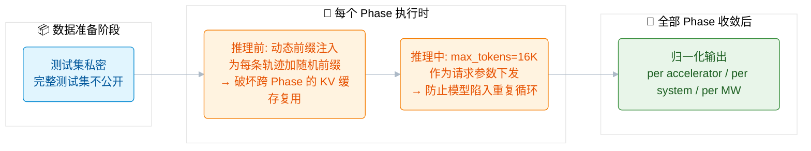

> **核心金句：** 当所有人都在卷单次推理延迟时，`Artificial Analysis` 用一个新基准告诉我们——真正的战场，是"在满足服务质量的前提下，一台机器到底能撑住多少个并发智能体"。

---

## 写在前面

随着 AI 发展进入下半场，越来越多的 `Agent` 从炫技"玩具"转变为商用落地产品。

不可避免的，会面临工程化的灵魂拷问：

> **灵魂拷问：** "我们这套集群，能同时服务多少个 `Coding Agent`？"

传统基准（如 `TTFT`、单请求吞吐、`tokens/s`）回答不了这个问题。

因为真实智能体的工作负载，和单轮问答完全是两个世界——它有**多轮交错推理**、**工具调用间歇**、**可变的上下文长度**，还会大量触发 `KV Cache` 复用和投机解码路径。

最近，`Artificial Analysis` 发布了 `AA-AgentPerf`——一个专为智能体时代设计的**硬件基准测试**。

本文基于其[官方方法论](https://artificialanalysis.ai/methodology/agentperf)与[发布文章](https://artificialanalysis.ai/articles/aa-agentperf)，带你拆解它的设计哲学、核心方法与工程启示。

---

## 一、为什么需要一个新的硬件基准？

### `Agent` 应用的六层结构与"评测断层"

在理解 `AA-AgentPerf` 之前，我们需要先看清 `Agent` 应用从软件到硬件的**完整分层结构**。

你会发现一个令人惊讶的事实：

> **关键洞察：** 层与层之间，存在巨大的评测断层。

一个 `Agent` 应用从用户需求到物理硬件，经过了六层抽象。每一层都是一个**独立的优化变量**：



> **为什么要分这么细？** 因为同一层换一个实现，整体表现可能差数倍。同样的硬件，换引擎差 `2x`；同样的引擎，换 `kernel` 差 `2-3x`。采购和架构决策必须能**定位到具体层**。

### 各层评测方法论的分布与"断层"

看清了六层结构，接下来看当前主流评测方法论在各层的分布：

| 层级 | 代表基准 / 指标 | 核心问题 | 评测特点 |
|------|----------------|---------|---------|
| **① 应用任务层** | 业务自定义指标 | 这个应用能解决用户问题吗？ | 高度场景化，无统一基准 |
| **② 智能体框架层** | `SWE-bench`, `AgentBench`, `WebArena`, `GAIA` | 这个 `agent` 能完成任务吗？ | 测**任务完成率**，不关心底层性能 |
| **③ 模型能力层** | `MMLU`, `HumanEval`, `GSM8K`, `LMSYS Arena` | 这个模型聪不聪明？ | 测**准确率/ELO**，单次推理，不并发 |
| **④ 推理引擎层** | `TTFT`, `tokens/s`, `throughput`（多为厂商自测） | 这个引擎快不快？ | 测**单请求/低并发**，负载多为合成 |
| **⑤ 算子运行时层** | 微基准（`kernel latency`, `profiler`） | 这个算子优化得好吗？ | 极度微观，脱离真实负载 |
| **⑥ 物理硬件层** | `MLPerf-Inference`, `FLOPS`, `HBM` 带宽, `TDP` | 这个硬件强不强？ | **合成静态负载**，假设单轮均匀请求 |

看完这张表，问题很明显。

> **评测断层：** 上层（①②③）只关心"能不能做对"，完全不关心"能不能扛住规模"；下层（④⑤⑥）只关心"单点快不快"，用的是合成负载，与真实 `Agent` 工作负载脱节。没有任何一个基准，用真实的 `Agent` 轨迹，去压测引擎+硬件的综合承载力。

这就是"评测断层"。

传统基础设施基准（如 `MLPerf-Inference`）诞生于"问答时代"，假设请求是独立的、均匀的、单轮的。但智能体工作负载完全打破了这个假设：

| 维度 | 传统基准 | 真实智能体工作负载 |
|------|---------|------------------|
| **请求模式** | 独立、均匀的单轮提示 | 多轮、交错推理 + 工具调用 |
| **上下文长度** | 固定或单一分布 | `5K–131K` `tokens` 大幅波动，均值约 `27K` |
| **输出特征** | 长度相对可预测 | 短工具调用 vs. 长推理链差异巨大 |
| **压力点** | 主要压显存与计算 | 额外压 `KV Cache` 复用、调度器、投机解码 |
| **"性能"定义** | 平均延迟 / 峰值吞吐 | 服务质量约束下的**最大并发承载量** |

### `AA-AgentPerf` 的定位：纵向跨界基准

`AA-AgentPerf` 正是为了填补这个断层而生的。

它是一个**纵向跨界基准**（`Vertical Cross-layer Benchmark`）——用 ②层的真实工作负载，去衡量 ④⑤⑥层在 `SLO` 约束下的综合表现：



这是传统基准从未做过的。

它把评测对象从"模型"扩展到"硬件 × 引擎 × 拓扑 × 调度器"的完整栈，归一化单位从 `tokens/s`（单请求）变成 `agents/accelerator`、`agents/MW`。

决策受众从算法研究员变成硬件采购与 `infra` 架构师。

> **跨时代意义：** 从"能力评测"到"经济学评测"——它不再问"模型能不能做对"，而是问"这套系统能不能在可接受成本下规模化服务"。这是 `Agent` 走向商业化的必经一跳。

---

## 二、核心方法论

### 1. 真实轨迹：考题采集与回放

#### 轨迹是"考题"，评测时是"回放"而非"真跑"

很多人会误解：以为评测时是跑一个真 `Agent` 去解决新问题。

**不是的。**

真实轨迹的作用是**考题（负载源）**，评测时是**回放**这些轨迹：



> **为什么要回放？** 因为跑真 `Agent` 每次的输出可能不同（模型有随机性），无法做可复现的公平对比。回放固定轨迹，所有系统跑的是**同一套考题**，差异只来自硬件+引擎，这才是我们要比的东西。

#### 轨迹库的特征

数据集来自 `OpenCode` 智能体框架中，使用三款开源模型（均开启推理能力）在真实公开代码仓库中解决 `issue` 时采集。

覆盖 **12+ 种编程语言**（`Python` 最多，其次 `TypeScript` 与 `Go`），核心特征如下：

| 维度 | 详情 |
|------|------|
| **输入序列长度 (`ISL`)** | 约 `5K–131K` `tokens`，均值约 `27K`，截断以适配被测模型上下文 |
| **输出序列长度 (`OSL`)** | 各轮差异显著——短工具调用 vs. 长推理链 |
| **工具调用延迟** | 按真实工具时长分布采样，`0.1s–5s`，中位数约 `1s`，按工具类型分区 |
| **调优子集** | `500` 条轨迹（`18,997` `prompts`）公开供调参，完整测试集保密 |

> **核心特征：** 轨迹具备**交错推理与工具调用**、**可变上下文长度**两大特征，能真实再现智能体对 `KV Cache` 复用、前缀共享、投机解码路径的压力——这是合成提示无法做到的。

### 2. 市场衍生的 `SLO` 分层

#### 先搞懂：什么是 `SLO`？

`SLO` = `Service Level Objective`（服务等级目标），通俗说就是**"你对用户承诺的服务质量底线"**。

想象你开了一家饭馆，有人问："你这店能同时接待多少桌客人？"——这个问题其实**没法回答**，除非你先定义"接待"是什么意思：

| 承诺质量 | 能接待的桌数 |
|---------|------------|
| "上菜不超过 30 分钟，好不好吃不管" | `100` 桌 |
| "上菜不超过 10 分钟，菜品必须热乎" | `50` 桌 |
| "上菜不超过 5 分钟，米其林品质" | 可能只有 `15` 桌 |

**同样是"能接待多少桌"，承诺的质量不同，答案天差地别。**

`SLO` 就是那个"承诺的质量"。

在 `AA-AgentPerf` 中，`SLO` 包含两个约束：

| 约束项 | 类比 | 含义 |
|--------|------|------|
| **输出速度** | "上菜速度" | 每个 `Agent` 每秒能吐多少 `Token` |
| **`TTFT` 首延迟** | "点单后多久开始上" | `Agent` 发出请求后多久能等到第一个字 |

> **为什么 `SLO` 这么重要？** 因为没有质量底线的"并发数"就是耍流氓。厂商可以堆 `500` 个并发，但每个 `Agent` 等首 `Token` 等 `60` 秒、输出像挤牙膏——这算"支持 `500` 并发"吗？`AA-AgentPerf` 用 `SLO` 把这条路堵死：**先定质量及格线，再比谁能撑更多并发。**

#### `SLO` 标准是怎么制定的？

不是拍脑袋定的，而是从市场真实数据中**反向推导**出来的：



#### `SLO` 分层与现实含义

就像机票分经济舱/商务舱/头等舱，不同档位对应不同的用户体验与价格。

**`DeepSeek V4 Pro` (`max reasoning`) 的 `SLO` 分层：**

| 分层 | P25 输出速度 (`tokens/s`) | P95 `TTFT` (`s`) | 类比 | 适用场景 |
|------|--------------------------|-------------------|------|---------|
| Tier 1 | `20` | `≤ 10` | 经济舱 | 后台批处理，慢点无所谓 |
| Tier 2 | `60` | `≤ 5` | 商务舱 | 日常 `Coding` 辅助，要跟手 |
| Tier 3 | `180` | `≤ 3` | 头等舱 | 实时交互场景，要丝滑 |

**`gpt-oss-120b` (`high reasoning`) 的 `SLO` 分层：**

| 分层 | P25 输出速度 (`tokens/s`) | P95 `TTFT` (`s`) | 类比 | 适用场景 |
|------|--------------------------|-------------------|------|---------|
| Tier 1 | `100` | `≤ 5` | 经济舱 | 后台批处理 |
| Tier 2 | `250` | `≤ 3` | 商务舱 | 日常交互 |
| Tier 3 | `500` | `≤ 2` | 头等舱 | 实时场景 |
| Tier 4 | `2,000` | `≤ 1` | 私人飞机 | 零延迟容忍 |

**两个设计细节值得注意：**

| 设计选择 | 原因 |
|---------|------|
| **`P25` 输出速度而非 `P50`** | 智能体工作负载中存在大量小 `OSL` 请求（如简单工具调用），`P25` 能更好反映"短请求是否被充分服务" |
| **`P95 TTFT`** | 首 `Token` 延迟的长尾，直接决定智能体在多轮交互中的"响应感" |

> **质量-容量曲线：** 每个系统在**每个分层**都会得到一个结果——放宽速度目标，就能换取更多并发智能体；收紧质量要求，并发数就下降。这条"质量-容量"曲线，才是真实部署经济学的全貌。

### 3. 端到端评测流程：一个具象例子

光讲方法论太抽象，让我们用一个具体场景走一遍完整流程。

#### 场景设定

假设我们是硬件厂商，要提交一套系统给 `AA-AgentPerf` 评测：

| 配置项 | 值 |
|--------|-----|
| 硬件 | `NVIDIA H100 × 8` |
| 推理引擎 | `vLLM` (`PagedAttention`) |
| 模型 | `DeepSeek V4 Pro` (`max reasoning`) |
| 目标 `SLO` | Tier 2：`P25` 输出速度 `≥ 60 tokens/s`，`P95 TTFT ≤ 5s` |

#### 流程总览



#### 单个模拟 `Agent` 的工作时序

在深入爬坡细节前，先理解**一个模拟 `Agent` 在干什么**。

它不是简单地发请求，而是顺序走完一整条真实轨迹：



> **关键点：** 每个 `Agent` 在处理轨迹时，会**持续保持 `in-flight` 请求**——一轮结束后立即进入下一轮，不给系统喘息机会。这正是"持续并发负载"（`Sustained Concurrent Load`）的含义，它能压满 `KV Cache`、调度器、投机解码路径。

#### 指数爬坡：从 2 到翻车

系统从 `2` 个并发 `Agent` 开始，每轮翻倍，直到 `SLO` 违规：



Phase 4 翻车了。

`16` 个 `Agent` 同时抢资源，每个都在排队，输出速度掉到 `42 tokens/s`（< `60`），`TTFT` 飙到 `7.2s`（> `5s`）。于是进入二分搜索。

#### 二分搜索：在 8 和 16 之间收敛

在 `8`（通过）和 `16`（失败）之间二分，逐步逼近边界：



**最终结论：这套系统在 Tier 2 `SLO` 下，最多支撑 `11` 个并发 `Agent`。**

#### 稳态判定条件（每个 `Phase` 都要满足）

每个 `Phase` 不是跑一下就出结果，必须同时满足三个条件才算"稳态"：

| 条件 | 为什么需要 |
|------|-----------|
| `≥30` 条轨迹完成 | 统计显著性，避免偶发波动 |
| 每个模拟 `Agent` 完成 `≥3` 条轨迹 | 确保每个 `Agent` 都经历了多轮交互的完整压力 |
| `≥10` 分钟稳态测量时间 | 排除冷启动效应，让调度器进入稳态 |

> **踩坑警告：** 如果只跑 `30` 秒就出数据，冷启动效应会严重污染指标——`KV Cache` 还没填满、调度器还在适应负载，数据不代表真实稳态表现。

### 4. 防作弊与归一化

#### 防作弊：贯穿测试全流程

基准测试最怕"针对 `benchmark` 的定向优化"。

> **特别澄清：** 防作弊不是最后一步才做，而是贯穿在整个测试流程中，不同机制在不同时机生效。



| 防作弊手段 | 生效时机 | 说明 |
|-----------|---------|------|
| **测试集私密** | 数据准备阶段 | 提供 `500` 条轨迹（`18,997` `prompts`）供调参，完整测试集保密 |
| **动态前缀注入** | **每个 `Phase` 推理前** | 为每条轨迹动态生成随机前缀，破坏跨 `Phase` 的 `KV Cache` 复用 |
| **`max_tokens=16K`** | **每次请求时** | 作为请求参数下发，防止模型陷入重复循环污染结果 |

> **关键纠正：** 防作弊发生在推理前/推理中，不是最后才做。归一化才是真正的最后一步。

#### 归一化：真正的最后一步

当二分搜索收敛、得出 `max agents` 后，才进入归一化。

结果按三个维度归一化，以实现跨硬件公平比较：

```
原始结果:  max agents = 11 @ Tier 2
         ↓
每加速器:  11 / 8 H100 = 1.375 agents/accelerator
         ↓
每兆瓦:   11 / 4.2kW = 2,619 agents/MW  (基于实测负载功耗)
```

| 归一化维度 | 计算方式 | 说明 |
|-----------|---------|------|
| **每加速器** (`Per Accelerator`) | `max agents ÷ 加速器数量` | 比较单卡效率 |
| **每系统** (`Per System`) | 整机可支撑的 `agent` 数 | 比较整机能力 |
| **每兆瓦** (`Per MW`) | 基于实测负载功耗 | 比较能效 |

> **能效陷阱：** 用 `TDP` 美化能效是厂商常见操作——实测功耗才贴近真实部署成本。`AA-AgentPerf` 基于 `GPU die + HBM` 实测功耗而非额定 `TDP`。

此外，速度指标使用**服务端 `usage metadata` + 本地 `tokenizer` 双重校验**，避免不同推理框架（`vLLM` / `SGLang` / `TGI`）的计数口径差异导致乌龙。

---

## 总结

`AA-AgentPerf` 的核心价值，在于将推理基准从**"单次推理性能"**提升到**"真实智能体工作负载下的系统承载力"**。

目前 `DeepSeek V4 Pro` 已有结果，`gpt-oss-120b` 标注 `Coming soon`，基准生态正在扩展。

每个系统在每个 `Tier` 都有结果——这为采购决策提供了"性能-成本"曲线，而非单点数字。同样是"能跑 `100` 个 `agent`"，Tier 1（宽松）和 Tier 3（严格）下的硬件配置差距可能数倍。

> **四件套设计：** 真实轨迹采集 + 市场驱动 `SLO` + 二分搜索定标 + 多维归一化——是一个可直接落地的工程范式。

对从业者而言，最重要的启示或许是：

> **终极洞察：** 在智能体时代，"快"不再是单一数字，而是"在用户可接受的服务质量下，能撑住多少并发"。

这才是硬件、推理引擎、部署拓扑真正竞技的战场。

---

**参考资料：**

- [`AA-AgentPerf` 方法论页面](https://artificialanalysis.ai/methodology/agentperf)
- [`AA-AgentPerf` 发布文章](https://artificialanalysis.ai/articles/aa-agentperf)
- [`AA-AgentPerf` Leaderboard](https://artificialanalysis.ai/)
