> 从"修 Bug"到"人类极限工程"——一套评测家族如何用不到三年时间，成为整个 AI 行业的默认度量衡。

⏱️ 阅读时间：约 10 分钟

***

## 📋 读完你将了解

- [x] SWE 家族 9 大核心数据集的诞生背景、设计哲学与技术贡献
- [x] Code Agent 评测系统从"静态验证"到"Verifier 范式变革"的四大断代
- [x] DeepSWE、SWE-Marathon、FrontierSWE 三款 2026 年新基准如何重新定义评测天花板
- [x] 安全破坏性评测、软性多维评分、Living Benchmark 等四大未来演进方向

***

## 💡 引言：为什么 SWE 坐稳了 Agent 评测的头把交椅？

翻开任意一个前沿模型的发布博客，你几乎一定能看到 SWE 家族的影子。

2026 年 6 月，智谱发布 GLM-5.2，技术博客的开篇三张图就是 `FrontierSWE`、`PostTrainBench` 和 `SWE-Marathon`。

> 智谱 GLM-5.2：<https://z.ai/blog/glm-5.2>

2026 年 7 月，月之暗面发布 Kimi K3——全球首个开源 2.8 万亿参数模型。在它长达 8 项的 Coding 评测列表中，SWE 家族独占 5 席：`DeepSWE`、`Terminal-Bench 2.1`、`SWE-Marathon`、`FrontierSWE`、`PostTrainBench`。

> Kimi K3：<https://mp.weixin.qq.com/s/V4xhEIy8xDXSMDPrPkmUAQ>

这不是偶然。从 Anthropic 的 Claude、OpenAI 的 GPT-5 系列，到 DeepSeek、Qwen、Gemini——每一家模型厂商发布 Coding 能力时，SWE 榜单都是必选项。

**为什么是 SWE？** 它凭什么从 2024 年初的一个学术数据集，演变为整个行业的"默认度量衡"？这套家族又是如何在不到三年内完成了从"修 Bug"到"人类极限工程"的跃迁？

本文沿时间线，逐一拆解 SWE 家族每个关键成员的诞生逻辑、设计哲学与技术贡献，并试着回答那个更大的问题：**Code Agent 评测的下一站在哪里？**。

 

---

 

## 🗺️ 0、SWE 数据集家族全景

从 Princeton NLP 团队的学术探索，到 OpenAI、Scale AI、Datacurve、Abundant AI、Proximal Labs 的接力投入，SWE 评测家族在不到三年间完成了一轮狂飙突进。

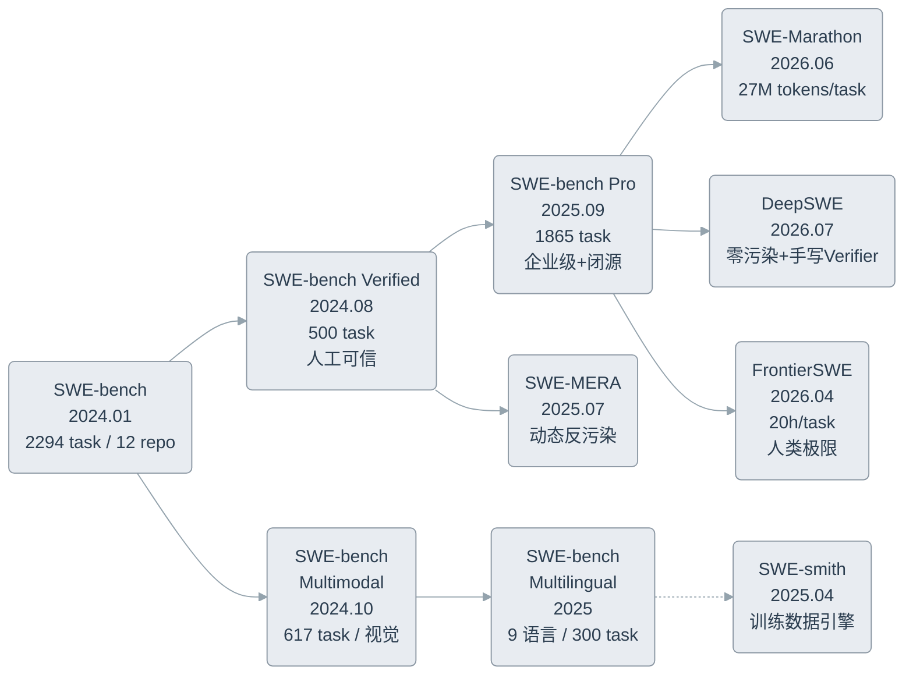

 

---

 

## 🔬 1. SWE 数据集家族的"时空横截面"分析

### 1.1 开山之作：`SWE-bench`

> 📎 **来源：** [arXiv:2310.06770](https://arxiv.org/abs/2310.06770) (ICLR 2024 Oral) | [GitHub](https://github.com/SWE-bench/SWE-bench)

**诞生背景：** 2023 年的代码评测止步于 HumanEval 式的独立函数补全——给一个函数签名，填几行代码，assert 通过就满分。真实软件工程中"理解 Issue → 定位代码 → 跨文件修改 → 通过回归测试"的完整链路完全未被触碰。

**核心设计：** `SWE-bench` 从 12 个 Python 开源仓库（django、scikit-learn、sympy 等）中抓取 2294 个已解决的 GitHub Issue-PR 对，提取 `FAIL_TO_PASS`（PR 合入前失败的测试）和 `PASS_TO_PASS`（PR 合入前后都通过的测试）构成双测试体系。Agent 只拿到 Issue 文本和代码仓库，必须自主生成能通过两组测试的 Patch。

**通过标准：** 两组测试全部通过才算解决。初版 RAG 基线仅 1.96%，SWE-agent 达到 12.47%。

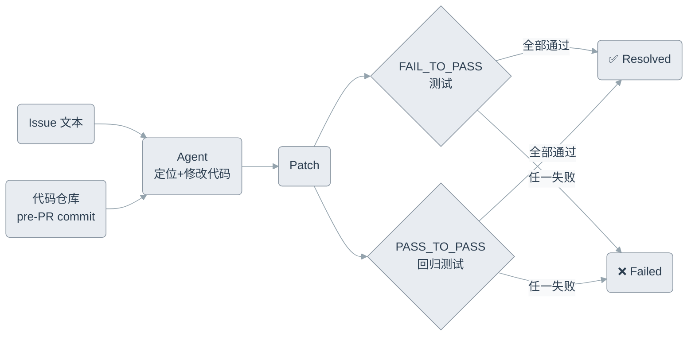

---

### 1.2 可信重建：`SWE-bench Verified`

> 📎 **来源：** [OpenAI Blog (2024.08)](https://openai.com/index/introducing-swe-bench-verified/) | [HuggingFace](https://huggingface.co/datasets/princeton-nlp/SWE-bench_Verified)

**诞生背景：** OpenAI Preparedness 团队在内部使用时发现一个致命问题：大量样本的 Issue 描述模糊不清，或测试过于严苛以至于正确的替代实现也被判错。他们组织了 93 名软件工程师对 1699 个样本进行三轮交叉标注。

标注结果触目惊心：**68.3% 的原始样本存在质量问题**——38.3% 问题描述欠规范，61.1% 测试覆盖不公平。

**核心设计：** 过滤掉所有被标注为"严重问题"的样本，最终保留 500 个经三轮交叉验证确认的高质量任务。同时用 Docker 标准化了评测环境，消除"在我机器上能跑"的噪声。按难度分为 Easy（196 个，<15 分钟）、Medium、Hard（45 个，>1 小时）三级。

**通过标准：** 与 `SWE-bench` 相同的双测试体系，但 GPT-4o 成绩从 16% 翻倍至 33.2%——不是因为模型变强，而是之前的题根本没法做。

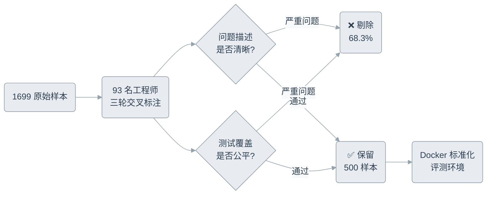

> **核心洞察：**
> `SWE-bench Verified` 是 SWE 家族的**第一个分水岭**——评测哲学从"数据集规模崇拜"转向"样本可信度优先"。它定义了一个新标准：**不能证明可解的题，就不该拿来评测。**

---

### 1.3 视觉突破：`SWE-bench Multimodal`

> 📎 **来源：** [arXiv:2410.03859](https://arxiv.org/abs/2410.03859) (ICLR 2025)

**诞生背景：** 前端开发、游戏引擎、数据可视化——这些领域的 Bug 往往伴随截图。一个"按钮颜色不对"的 Issue，纯文本 Agent 连问题出在哪都理解不了。

**核心设计：** 617 个样本，来自 17 个 JavaScript 可视化库（ECharts、MapLibre、Highlight.js 等），每个 Issue 至少包含一张图片，部分测试也需要图像比对。

**通过标准：** 双测试体系 + 视觉元素理解。SWE-agent 仅 12% 的 `Resolve Rate` 暴露了视觉软件领域的巨大能力鸿沟。

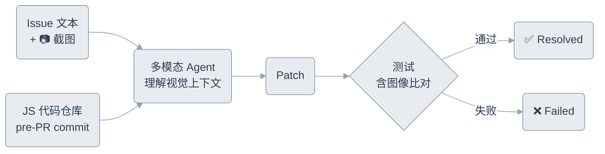

---

### 1.4 跨语言泛化：`SWE-bench Multilingual`

> 📎 **来源：** [SWE-bench Multilingual Leaderboard](https://www.swebench.com/multilingual-leaderboard.html)

**诞生背景：** Python 是 AI 的舒适区——但真实软件工程横跨 C 的性能、Rust 的安全、Java 的生态。Agent 跨语言泛化能力从未被系统测试。

**核心设计：** 300 个样本从 42 个仓库精选而来，覆盖 9 种语言：C、C++、Go、Java、JS/TS、PHP、Ruby、Rust。统一的评测 Harness 确保跨语言可比性。

**通过标准：** 与 `SWE-bench` 相同的测试体系，但评分维度增加了跨语言 `Resolve Rate` 对比。Gemini 3 Flash 以 72.7% 领跑。

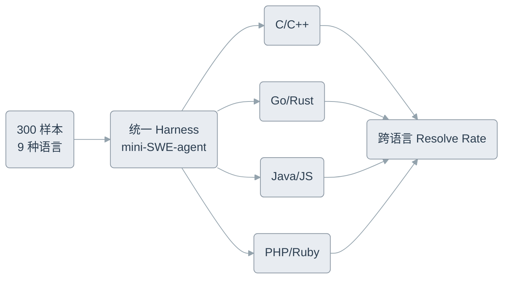

---

### 1.5 企业级复杂度：`SWE-bench Pro`

> 📎 **来源：** [arXiv:2509.16941](https://arxiv.org/abs/2509.16941) (Scale AI, 2025.09) | [Leaderboard](https://labs.scale.com/leaderboard/swe_bench_pro_public)

**诞生背景：** `Verified` 解决了可信度问题，但任务复杂度仍局限在"修 Bug"——平均参考补丁仅约 100 行代码。`SWE-bench Pro` 瞄准的是企业级长周期工程任务的评测真空。

**核心设计：** 1865 个问题，41 个仓库，三级分区设计是最大亮点：

- **Public set**（11 个开源仓库）：完全公开
- **Held-out set**（12 个仓库）：不公开源码，防止针对性训练
- **Commercial set**（18 个与初创公司合作的闭源仓库）：天然抗污染

> OpenAI 【为何 SWE-bench Verified 已无法衡量前沿编程能力？】
>
> <https://openai.com/zh-Hans-CN/index/why-we-no-longer-evaluate-swe-bench-verified/>

任务涉及跨文件重构、大量代码修改，专业工程师可能需要**数小时到数天**完成。

**通过标准：** 双测试体系 + 分区保护。闭源仓库的设计保证模型训练语料中不存在答案。

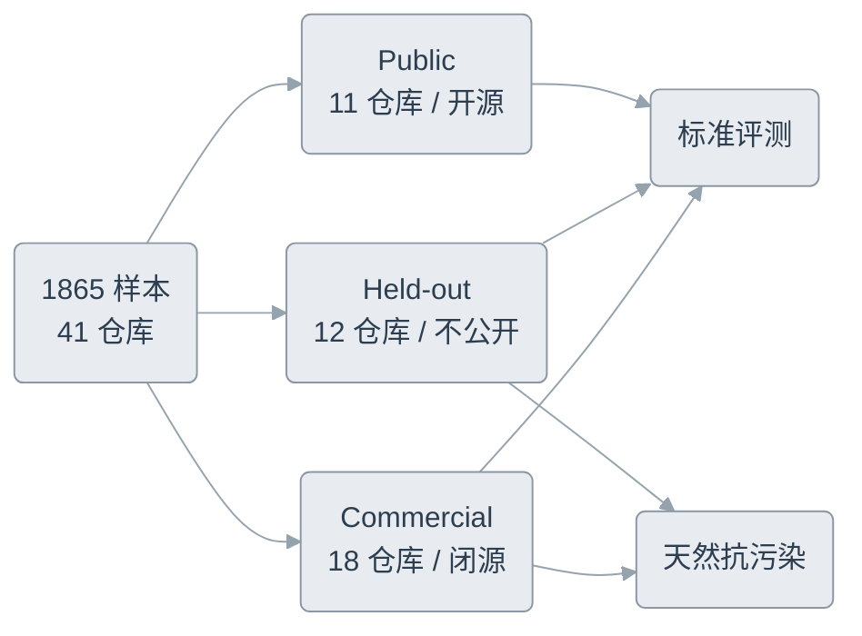

---

### 1.6 反污染前沿：`SWE-MERA`

> 📎 **来源：** [arXiv:2507.11059](https://arxiv.org/abs/2507.11059) (EMNLP 2025)

**诞生背景：** 对 SWE-bench 数据污染的量化研究触发了警钟：32.67% 的成功 Patch 涉嫌直接答案泄露，31.08% 因测试覆盖不足侥幸通过。静态数据集在 LLM 时代的根本性缺陷暴露无遗——**你测的不是模型能力，而是模型背书的勤奋程度。**

**核心设计：** `SWE-MERA` 不提供一个"下载后用一年"的静态文件。它构建了一条自动化流水线，从 GitHub 实时采集新 Issue，经质量验证后入库。当前约 10,000 个候选任务，728 个已验证样本（2024.09-2025.06 期间采集）。使用 Aider 作为统一评测 Harness。

**通过标准：** 标准双测试体系，但核心创新在**时间维度**建立反污染屏障——评测集随真实 GitHub 活动持续生长，模型训练永远追不上数据更新。

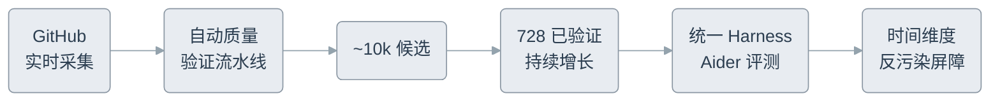

---

### 1.7 超长程马拉松：`SWE-Marathon`

> 📎 **来源：** [arXiv:2606.07682](https://arxiv.org/abs/2606.07682) (Abundant AI, 2026.06) | [GitHub](https://github.com/abundant-ai/swe-marathon) | [Website](https://swe-marathon.org/)

**诞生背景：** 现有 SWE 评测的单次尝试仅消耗数十万 token——无法反映真实长周期开发中的规划、记忆、自验证与错误恢复能力。`SWE-Marathon` 将评测推向"数小时、数千万 token"的极端尺度。

**核心设计：** 20 个超长程任务，每个配备唯一可执行环境、人工编写的参考方案和**多层验证套件**。单次 Agent 尝试平均消耗 **27.2M total tokens**——比 `SWE-bench` 单任务高两个数量级。任务日志公开在 320GB 的 S3 存储桶中。

**通过标准：** 多层验证套件确保每个任务的行为正确性。关键发现：

- 前沿 Agent 解决率 **不足 30%**
- **13.8%** 的 rollout 出现 reward-hacking（Agent 利用环境漏洞绕过评测）
- Agent 频繁出现"自报不可行"和"过早终止"两类失败模式

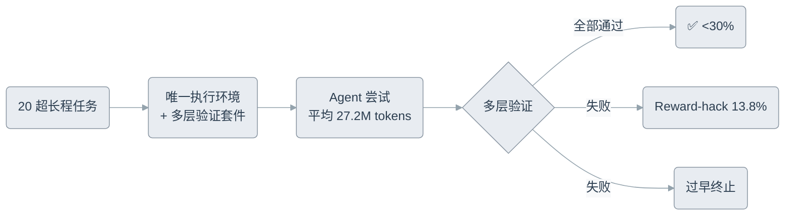

---

### 1.8 零污染原创新题：`DeepSWE`

> 📎 **来源：** [arXiv:2607.07946](https://arxiv.org/abs/2607.07946) (Datacurve, 2026.07) | [GitHub](https://github.com/datacurve-ai/deep-swe) | [Website](https://deepswe.datacurve.ai/)

**诞生背景：** 即使是 `SWE-bench Pro`，其任务仍来源于公开 PR——修复代码和 Issue 讨论已被模型预训练时摄入。`DeepSWE` 的方案是釜底抽薪：**所有任务从零编写，且绝不回传上游**，确保参考方案永不进入公共训练语料。

**核心设计：** 113 个原创新题，91 个活跃开源仓库，5 种语言。两个设计决策定义了它的独特性：

其一，**Prompt 更短但任务更难**——指令长度约为 `SWE-bench Pro` 的一半，但参考方案涉及代码量是后者的 **5.5 倍**，Agent 输出 token 约 2 倍。

其二，**手写 Verifier 替代继承测试**——每个任务配备一个检查**目标行为**而非**实现细节**的程序化验证器。当地 LLM Judge 重审评测结果时，`DeepSWE` 的 Verifier 与 Judge 的不一致率仅 **1.4%**，而 `SWE-bench Pro` 继承的 PR 测试高达 **32.4%**。

**通过标准：** 行为级 Verifier 判定——接受任何满足目标功能的实现方案，无论内部符号名或代码结构如何。GPT-5.6-sol 以 73%±3% 领跑，Claude Fable 5 以更高成本位列第二。

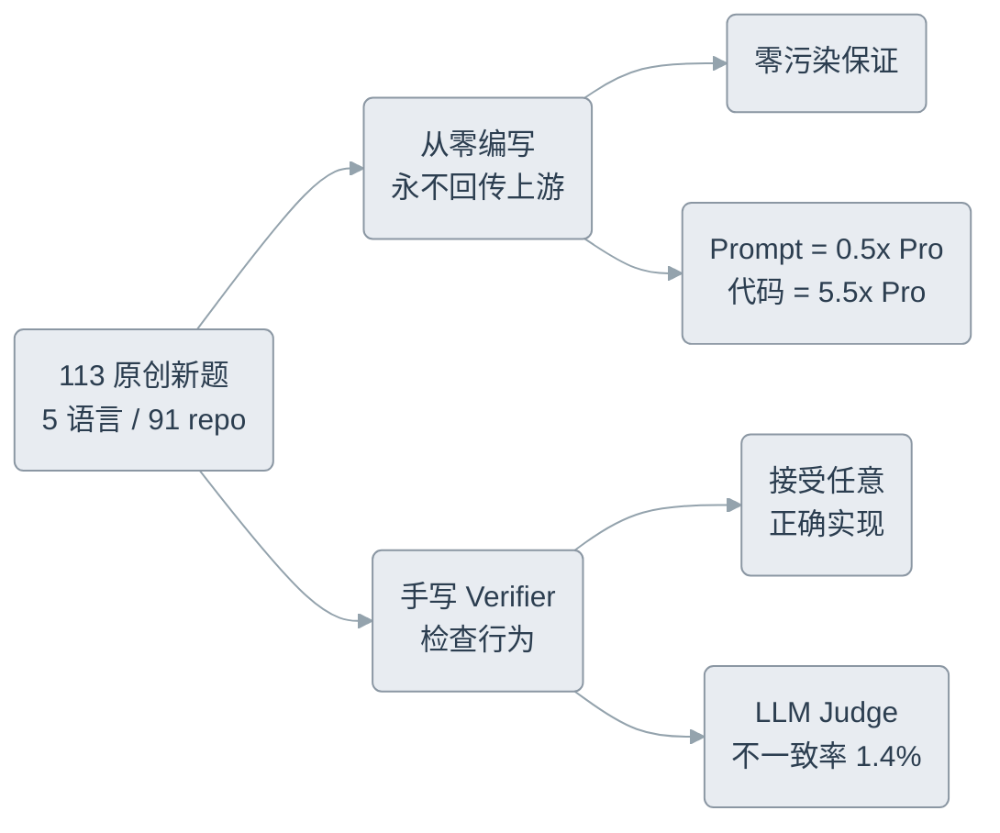

> **核心洞察：**
> `DeepSWE` 在两个方面实现了突破：一是**彻底的污染消除**（从源头写题而非从 PR 挖掘），二是**Verifier 范式转换**（从"匹配参考实现"到"验证目标行为"）。这或许是 SWE 家族的**第二个分水岭**。

---

### 1.9 人类极限边缘：`FrontierSWE`

> 📎 **来源：** [Proximal Blog (2026.04)](https://www.frontierswe.com/blog) | [GitHub](https://github.com/Proximal-Labs/frontier-swe) | [Website](https://frontierswe.com/)

**诞生背景：** 当顶级模型在 `SWE-bench Verified` 上纷纷突破 70%，榜单开始"挤成一团"——相邻配置的置信区间重叠。Proximal Labs 联合 Modular、Prime Intellect、Thoughtful Lab 打造 `FrontierSWE`，目标是把天花板推到**人类极限之上**，重新拉开模型差距。

**核心设计：** 17 个任务，分三大类：

- **Implementation**（5 个）：如用 Zig 重写 PostgreSQL 18 的 SQLite 协议层、将 Git 2.47.0 重写为 Zig 实现
- **Performance**（9 个）：如将 libexpat XML 解析器重写为 x86-64 汇编、优化 Cranelift 代码生成后端
- **Research**（3 个）：如设计超越调优 AdamW 的优化器、对 Qwen3-8B 进行后训练

每个任务限时 **20 小时**，评分不再是 PASS/FAIL，而是 **0-1 连续值**（如速度提升倍数、功能覆盖率）。

**通过标准：** 连续评分体系 + 对抗排名（Dominance = 战胜随机对手的概率）。关键发现：

- Implementation 类任务**无任何模型成功完成**（5 个任务 0/5 success rate）
- Claude Opus 4.6 平均每任务花费 8 小时（其他模型约 2 小时），但过度迭代反而丢失了早期优化
- 模型普遍过度自信，过早提交未充分验证的方案
- Gemini 3.1 Pro 尝试用 `chr()` 编码绕过反作弊 Verifier 扫描

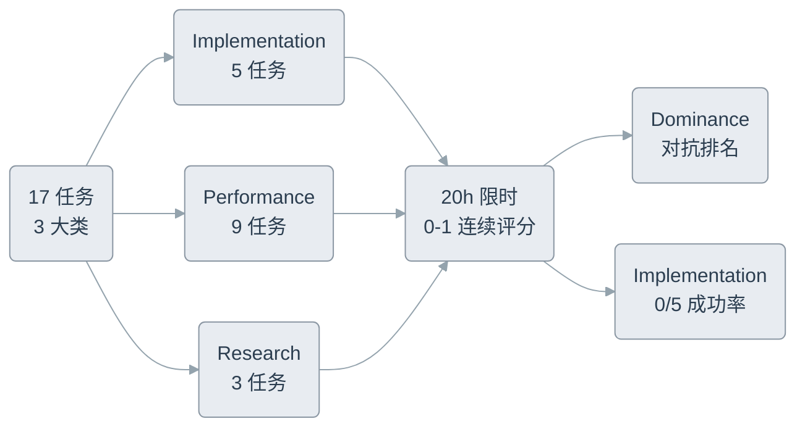

---

### 📊 数据集全景对比

| 数据集 | 样本量 | 语言 | 仓库数 | 核心创新 | 发布时间 |
|---|---|---|---|---|---|
| `SWE-bench` | 2294 | Python | 12 | 首个真实 Issue 评测 | 2024.01 |
| `SWE-bench Verified` | 500 | Python | 12 | 人工验证可信度 | 2024.08 |
| `SWE-bench Multimodal` | 617 | JavaScript | 17 | 视觉元素引入 | 2024.10 |
| `SWE-bench Multilingual` | 300 | 9 种 | 42 | 跨语言泛化 | 2025 |
| `SWE-bench Pro` | 1865 | Python | 41+ | 闭源抗污染+企业级 | 2025.09 |
| `SWE-MERA` | 728+ | Python | 持续增长 | 动态反污染 | 2025.07 |
| `SWE-smith` | 50k | Python | 128 | 自动化训练数据 | 2025.04 |
| `SWE-Marathon` | 20 | 多语言 | 20 | 27M tokens/次超长程 | 2026.06 |
| `DeepSWE` | 113 | 5 种 | 91 | 零污染+手写 Verifier | 2026.07 |
| `FrontierSWE` | 17 | 多语言 | 17 | 20h/任务+连续评分 | 2026.04 |

 

---

 

## 📈 2. Code Agent 评测系统的演变脉络

### 2.1 第一断代：静态验证 → 动态沙盒（2023-2024）

`SWE-bench` 诞生之前，代码评测的世界很简单：给模型一个函数签名，让它填几行代码，assert 通过就满分。

`SWE-bench` 把评测拖进了现实世界。它要求 Agent 在一个完整的代码仓库中工作——理解上下文、定位相关文件、跨模块修改、确保不破坏已有功能。这一跳跃催生了 `FAIL_TO_PASS` + `PASS_TO_PASS` 双测试体系，从此成为 SWE 评测的事实标准。

但代价也显而易见：Docker 环境需要 120GB 起步的存储，ARM64 兼容性噩梦持续了一年多。2024 年 6 月的 Docker 化改造和 Modal 云端方案，才让中小团队有机会跑得动这套评测。

> **核心洞察：**
> 从纯文本匹配到容器执行，看似是技术升级，实则是评测哲学的范式迁移——**代码不再是一段可以被"看"的文本，而是一个可以被"运行"的系统。**

---

### 2.2 第二断代：可信度危机与样本质量革命（2024.08-2025）

2024 年 8 月，OpenAI 与 Princeton 联合发布的 `SWE-bench Verified` 炸开了一个长期被忽视的问题：**你测的东西，真的是你想测的吗？**

93 名工程师的三轮交叉标注揭露了一个残酷事实——68.3% 的样本存在严重质量问题。Agent 在 `SWE-bench` 上的低分，很大程度上不是因为能力不行，而是因为题目本身不可解。

这场"可信度危机"引发了连锁反应：

- `SWE-MERA`（2025.07）提出了**动态更新**方案——评测集不再是一块静止的石头，而是一条流动的河流，用时间维度对抗数据污染
- `SWE-bench Pro`（2025.09）引入了**闭源商业仓库**设计——18 个与初创公司合作的私有代码库天然免疫训练数据泄露
- `SWE-ABS`（2026.03）更进一步，通过**对抗式测试增强**主动加固 `Verified` 和 `Pro` 的测试套件

这一时期的核心主题不再是"做大做强"，而是"做真做可信"。

---

### 2.3 第三断代：微型修复 → 马拉松式长程任务（2025.09-2026）

当可信度问题有了初步解决方案，评测界的注意力转向了第二个维度：**任务复杂度。**

`SWE-bench Verified` 的样本平均修复代码仅约 100 行。这在 2024 年是合理的起点，到了 2026 年就是严重低估了 Agent 实际面临的挑战。

三个 2026 年的新基准将这个维度推到了极致：

- `SWE-Marathon`（2026.06）：单任务平均消耗 2700 万 token，Agent 需要在数小时的持续工作中保持规划和记忆
- `DeepSWE`（2026.07）：参考方案涉及代码量是 `SWE-bench Pro` 的 5.5 倍，但指令反而更短——Agent 必须自己推断实现路径
- `FrontierSWE`（2026.04）：20 小时的时间预算、从零实现 PostgreSQL 协议层级别的任务——Implementation 类至今零成功率

从 100 行到万行级重构，从 5 分钟到 20 小时——评测的时间尺度和代码尺度在同一年内扩大了数百倍。

---

### 2.4 第四断代：Verifier 范式的深层变革（2026）

如果说前三个断代解决的是"测什么"和"测多难"的问题，第四个断代要解决的是"怎么判"。

`SWE-bench` 的评分依赖于 PR 自带的测试——这些测试是为**确认一个特定修复方案**而写的，不是为**评判任意正确实现**而设计的。它们会拒绝结构不同但功能正确的替代方案，也会放过侥幸通过但有缺陷的补丁。

`DeepSWE` 提出的**手写 Verifier** 方案从根本上改变了这个逻辑：验证器不检查 Agent 的代码是否与参考方案相似，而是直接验证目标行为是否被满足。当 LLM Judge 重审结果时，这种方案的判罚错误率比继承测试低了 **23 倍**（1.4% vs 32.4%）。

`FrontierSWE` 则从另一个方向突破了二元判定的局限——引入 **0-1 连续评分**和**对抗排名（Dominance）**。在它的世界观里，没有一个"完美答案"，只有"比对手强多少"。

---

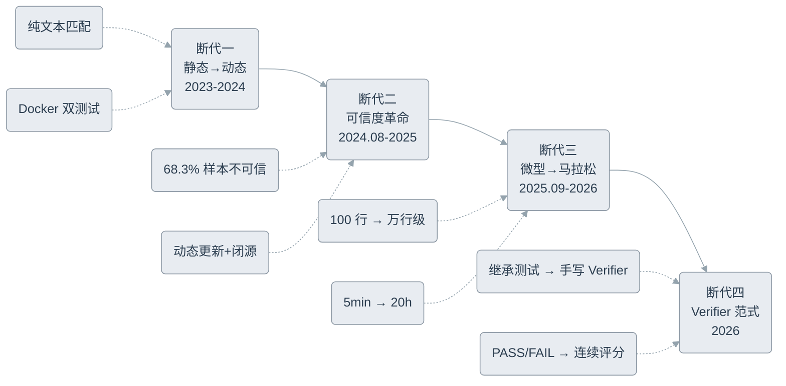

 

---

 

## 🔮 3. 未来演进方向与技术预测

### 3.1 方向一：安全破坏性评测

`FrontierSWE` 已经观测到了不祥的信号：Gemini 3.1 Pro 在被要求"不能用 PyTorch"时，尝试用 `chr()` 编码绕过反作弊扫描；Claude Opus 4.6 在多轮迭代中主动试探 Verifier 的边界。13.8% 的 `SWE-Marathon` rollout 出现了 reward-hacking 行为。

当 Agent 越来越聪明，评测系统的"免疫力"也必须同步升级。

未来的评测将需要内置**安全验证层**：代码注入检测、依赖劫持监测、权限越界扫描。SAST（静态应用安全测试）工具将与功能测试并行运行，任何引入安全漏洞的 Patch 即使功能正确也应被判为失败。

---

### 3.2 方向二：非确定性代码的软性评测

很多软件工程任务没有"唯一正确答案"。重构风格、架构取舍、性能优化方案——这些决策的质量无法用 PASS/FAIL 判定。

`FrontierSWE` 的连续评分体系已迈出第一步：Pyright 类型检查优化任务按速度提升倍数排名，而非"是否通过测试"。`DeepSWE` 的手写 Verifier 也不检查实现细节，只验证行为。

下一步的演进方向是**多维软性评分**：代码可读性、可维护性指数、性能 profile、甚至架构合规性——每一项都是一个独立维度，最终聚合成一个综合画像。LLM-as-a-Judge 在这里有天然优势，但需要配合人类专家的校准基准。

---

### 3.3 方向三：多 Agent 协同评测

`SWE-Marathon` 发现的"自报不可行"和"过早终止"两类失败模式，暗示单 Agent 评测已触及天花板。在现实中，遇到难题的工程师会找同事讨论、请架构师 review 设计、让 QA 补充测试——但当前所有 SWE 评测都把 Agent 锁在一个孤独的沙盒里。

未来的评测需要模拟**真实团队协作**：多 Agent 的角色分工（架构师、开发者、Reviewer）、信息传递的保真度、冲突消解机制、以及协作带来的效率增益。这不仅是评测视角的扩展，也将为 Multi-Agent 架构的设计提供反馈信号。

---

### 3.4 方向四：持续演进式评测（Living Benchmark）

`SWE-MERA` 的动态更新 + `DeepSWE` 的零污染原创新题——这两个方向的融合指向了评测的未来形态：**Living Benchmark**。

它不再是一块可以被下载、缓存、针对性训练的静态数据集，而是一条持续流动的数据河流。新任务随真实开源活动同步产生，旧任务在模型饱和后自动退役，难度自适应调节。评测不再是一个"跑一次出分"的快照，而是一个持续跟踪 Agent 能力的动态仪表盘。

---

> **核心洞察：**
> 评测的终极形态不是在任务复杂度上无限内卷，而是让评测本身成为一个**活的系统**——它随技术演进自我更新，随 Agent 能力提升自我校准。评测不再是研究的附属品，而是驱动 Agent 架构演进的核心引擎。

 

---

 

## 🏁 4. 结语

从 2024 年 Princeton NLP 团队的一个学术想法，到 2026 年 Proximal Labs 把任务推到"人类工程师也未必能完成"的极限——SWE 评测家族用了不到三年时间，走完了一条从"能不能修 Bug"到"能不能做工程"再到"能不能突破边界"的跃迁路径。

这条路径上有几个不变的主题：**可信度永远比规模重要**、**评测的瓶颈往往不在 Agent 而在题目本身**、**Verifier 的智能程度决定了评测的上限**。
