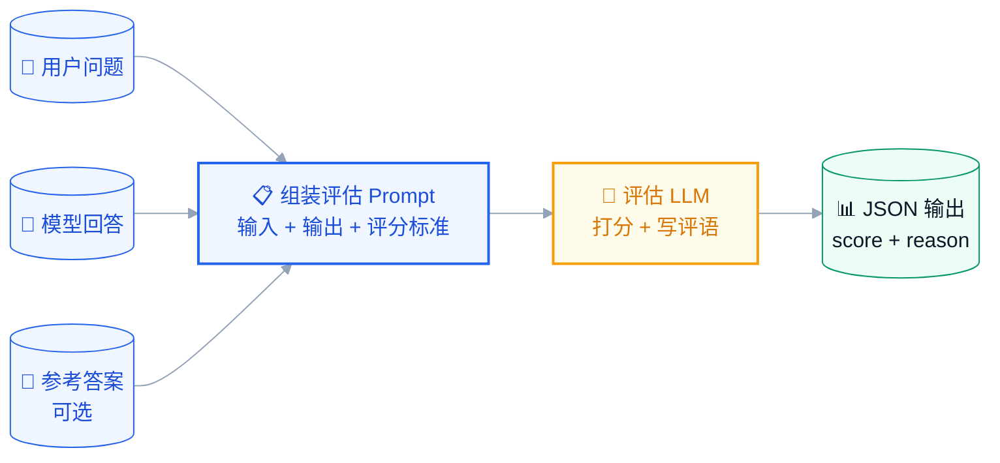
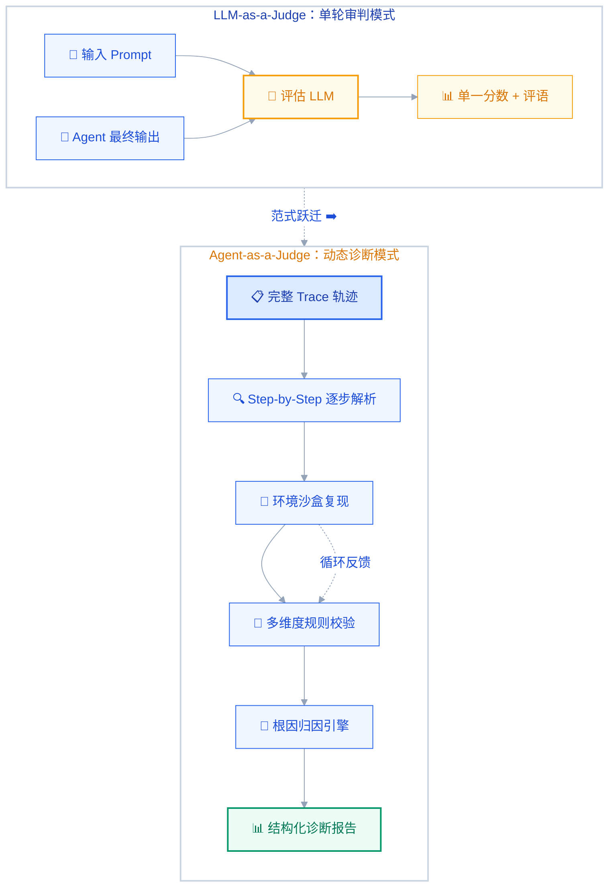
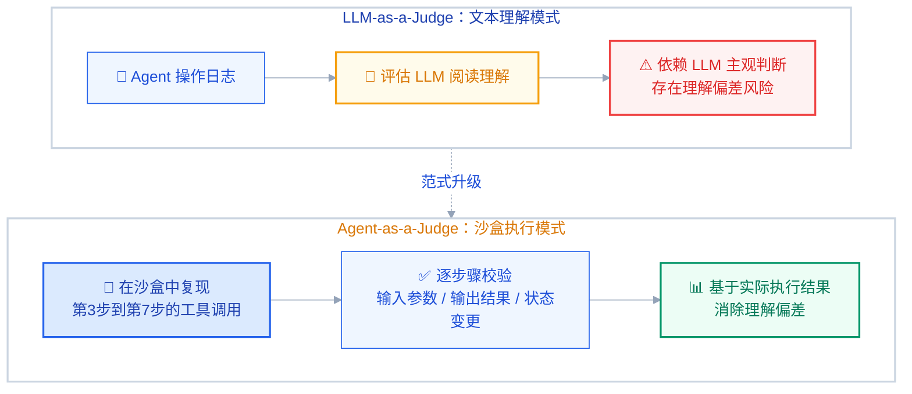
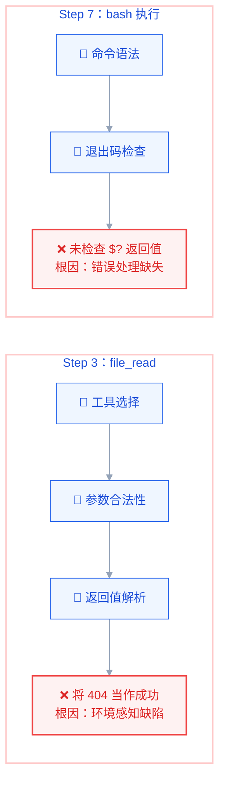
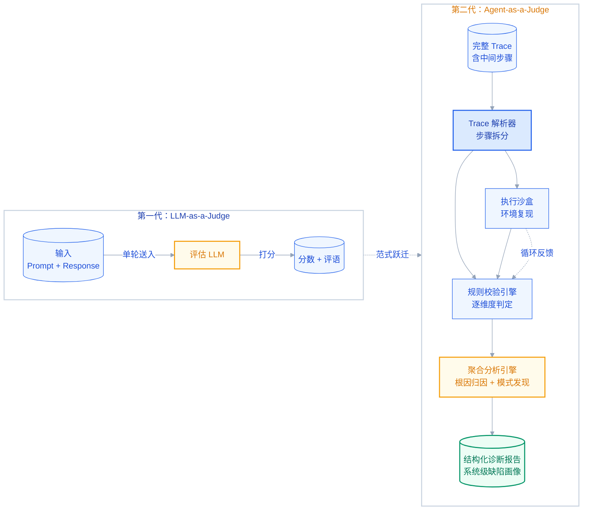
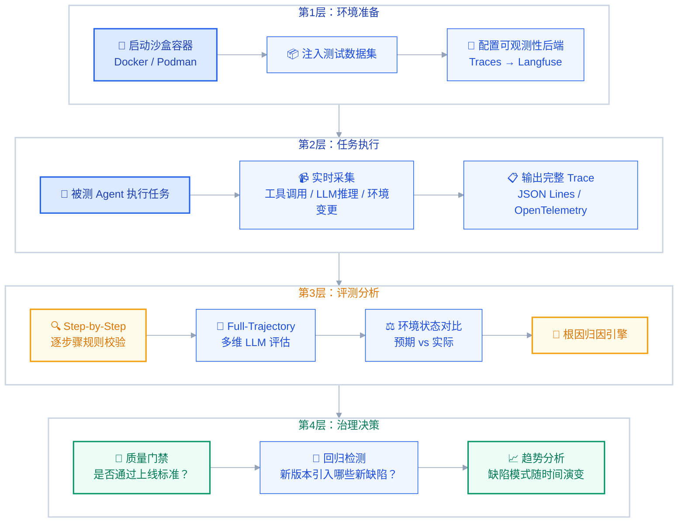

---
title: "从 LLM-as-a-Judge 到 Agent-as-a-Judge：AI 自动化评测的范式演进与破局"
author: ivanbao9783
date: 2026-07-24 09:03:04 +0800
categories: [技术笔记]
tags: [评测系统, LLM-as-a-Judge, Agent-as-a-Judge]
description: 从 LLM-as-a-Judge 到 Agent-as-a-Judge：AI 自动化评测的范式演进与破局。
---

> 当被评测的 AI 已经学会使用工具、操纵环境、多步推理时，评估它的"监考官"也必须进化——从一张静态的评分表，变成一个能进入考场、观察过程、诊断根因的自治系统。

⏱️ 阅读时间：约 15 分钟

---

## 📋 读完你将了解

- [x] `LLM-as-a-Judge` 为什么在 Agent 时代"不够用了"
- [x] `Agent-as-a-Judge` 的核心定义、设计哲学与破局逻辑
- [x] 两种范式的架构级对比：从数据流到评估粒度
- [x] AHE（Agentic Harness Engineering）实战拆解：评测即治理
- [x] 从"能跑就行"到"量化诊断"的工程落地路径
- [x] 自动化评测的下一个十年将走向何方

---

## 一、AI 评测的"监考官"危机

试想一个场景：你花了两周搭了一个 `Code Agent`，本地 Demo 行云流水。推到测试环境跑 100 条真实任务，挂了 23 条。几千行的执行日志里，Agent 调了 47 次工具、做了 12 次 LLM 推理、读写文件 8 次。你想知道是哪一步偏航了——**但你手上只有一个工具：人工逐行读日志。**

问题出在评测体系的断层。长久以来，评测 NLP 模型输出靠 BLEU、ROUGE 这类 n-gram 重叠指标——它们衡量的是"你和标准答案用的词是不是一样"，而不是"你说得对不对"。语义层面的准确、连贯、得体，这些指标无一能覆盖。

于是 `LLM-as-a-Judge` 出现了：用一个更强的模型来读输入、输出、评分标准，给出分数。不需要人类标注，不需要硬编码规则。这套方案在 Chatbot 时代运转良好——翻译质量、RAG 忠实度、推理自洽性，都能给出基本靠谱的判断。

但当被评测的对象从一问一答的 Chatbot 变成了能打开终端、读写文件、调用 API、在几十个步骤间跳转的 Agent 时，`LLM-as-a-Judge` 的结构性缺陷暴露了——**它只能看到"输入-输出"这对端点。** Agent 中间 48 步推理、10 次工具调用、3 次环境交互，这些真正决定成败的过程节点，在单轮审判框架下完全不可见。SWE-bench 系列已经证明了这一点：一个 `Code Agent` 修 Bug，最终 diff 可能是对的，但中间推理链全是错的——它碰巧蒙对了，而 `LLM-as-a-Judge` 对此毫无甄别力。

> **核心矛盾：**
> 当一个系统的复杂度已经超出"一问一答"的范畴，评估它的方法却还停留在"批改填空题"的思维模式——这就是当前 AI 评测体系的困境，也是 `Agent-as-a-Judge` 范式诞生的根本动因。

本文将从评测范式的底层逻辑出发，梳理从"单轮审判"到"系统化动态诊断"的演进路径，并结合 AHE（Agentic Harness Engineering）的实战思想，拆解如何用一个自治的评测 Agent 来治理另一个 Agent。

---

## 二、第一代范式：LLM-as-a-Judge 的辉煌与局限


### 2.1 什么是 LLM-as-a-Judge？

`LLM-as-a-Judge` 是一种用大语言模型评估另一个 AI 系统输出质量的自动化评测方法。

其核心机制并不复杂：构建一个结构化的评估 Prompt，将"原始输入 + 模型输出 + 评分标准"一并送入一个更强（或同等水平）的 LLM，让它输出分数、标签或结构化的评语。



最常见的三种评估设置：

- **基于提示的评估（Prompt-based）**：最直接的形式，评估 LLM 按照自然语言指令打分。灵活但高度依赖 Prompt 工程质量。
- **基于评分标准的评估（Rubric-based）**：为每个分数级别定义明确的行为描述，类似教师的评分量规，提升大规模评估的一致性。
- **成对比较（Pairwise Comparison）**：同时展示两个响应，询问哪个更好。减少绝对打分难度，但每次评估需要两倍推理成本。


### 2.2 为什么它能取代传统指标？

在 `LLM-as-a-Judge` 兴起之前，NLG（自然语言生成）评测主要依赖 BLEU、ROUGE、METEOR 等基于 n-gram 重叠的自动指标。这些指标有致命的局限——它们衡量的是"字面相似度"，而非"语义质量"。

举个例子：

```text
参考答案：巴黎是法国的首都，以埃菲尔铁塔闻名于世。
模型回答：法国首都是巴黎，其标志性建筑包括埃菲尔铁塔。
```

BLEU 会给出低分，因为词汇顺序完全不同。但任何人类评委都会说：这两个回答说的是同一件事，且都是正确的。

`LLM-as-a-Judge` 解决了这个语义鸿沟。研究表明，顶尖 LLM 评估者在许多评估任务中与人类评委的一致性达到 80%-85%，而成本仅为人工评估的零头。

> **一句话总结 LLM-as-a-Judge 的诞生逻辑：**
> 传统指标死于"看不懂语义"，人工评估死于"太贵太慢"，LLM-as-a-Judge 在二者之间找到了一个实用主义的甜蜜点。


### 2.3 优劣势全景透视

| 维度 | 优势 ✅ | 劣势/致命伤 ❌ |
|:---|:---|:---|
| **评估速度** | 毫秒级单次推理，支持大规模并行评估 | 对复杂长文本推理成本显著上升 |
| **通用性** | 自然语言定义标准，无需硬编码规则 | Prompt 质量高度影响评估稳定性 |
| **语义理解** | 能捕捉语气、连贯性、帮助性等软性维度 | 存在系统性偏见（见下文详述） |
| **成本** | 远低于人工评估，边际成本趋近于零 | 评估模型本身也是 LLM，存在"裁判也被收买"的风险 |
| **可扩展性** | 一条 Prompt 可评估任意领域的输出 | 对于需要环境反馈的 Agent 任务完全失能 |
| **偏见问题** | — | **位置偏见**：偏好提示中靠前/靠后的响应 |
| | — | **冗长偏见**：倾向于给更长、更啰嗦的回答打高分 |
| | — | **自我偏好**：评估模型倾向于偏爱自己生成的风格 |
| | — | **古德哈特定律陷阱**：当评分成为优化目标，分数就不再反映真实质量 |

而所有这些局限之上，悬着一把最致命的剑——

> **Lost in Trajectory（迷失在轨迹中）：**
> `LLM-as-a-Judge` 只能看到"输入-输出"这对端点。Agent 的中间 48 步推理、10 次工具调用、3 次环境交互——这些真正决定了任务成败的过程节点——在这个框架下完全不可见。

你拿到一个分数："3.2/5.0"。但你不知道：
- 是第几步推理开始偏航的？
- 工具选择是对的还是参数填错了？
- 环境反馈被正确解读了吗？
- 这 100 条失败案例之间有共性模式吗？

**这些问题不回答，"评测"就只是贴标签，不是诊断。**

---

## 三、第二代范式：Agent-as-a-Judge 的崛起与破局


### 3.1 什么是 Agent-as-a-Judge？

`Agent-as-a-Judge` 不是一个"更强的打分模型"，而是一个**具备环境感知、工具调用、多步规则校验和全轨迹分析能力的自治评测系统**。

它不再是"你回答得好不好，打几分"的单轮审判官。

它是"我进入你的执行过程，观察你的每一步决策、验证你的每一次工具调用、诊断你的根因缺陷模式"的**全身体检医师**。




### 3.2 诞生背景：当 Agent 复杂到不可"只看结果"

2025 年，SWE-bench 系列的爆火给整个行业上了一课。

一个 `Code Agent` 修复一个 Bug 的过程，平均涉及 20-50 步 LLM 调用、多次文件读写、Git 操作、测试运行与解析。**只看最终的 diff 是否正确，就像你只看了期末考试成绩单，却完全不知道学生是哪一章没学会。**

更糟糕的是——很多 Agent 任务中，"最终结果正确"不等于"过程正确"。一个推理链全错的 Agent 可能碰巧蒙对了答案；一个工具调用全部选错的 Agent 可能因为运气好拿到了正确的环境返回值。

`LLM-as-a-Judge` 对这种"虚假正确"毫无甄别力。

而 `Agent-as-a-Judge` 的破局逻辑恰恰在于——


### 3.3 三大破局点

**破局一：从静态文本 → 动态执行沙盒**

`Agent-as-a-Judge` 不是凭空打分，而是将 Agent 的执行轨迹在沙盒环境中复现。它验证的不是"你说你做了"，而是"你做的对不对"。



这意味着：工具选择是否正确？参数是否合法？环境状态是否符合预期？——这些在 `LLM-as-a-Judge` 框架下无法回答的"中间态问题"，在 `Agent-as-a-Judge` 框架下变成了可执行的校验脚本。

**破局二：从粗粒度总分 → 细粒度 Trace 诊断**

`Agent-as-a-Judge` 不会给你一个"总分 3.2"，而是给你逐步骤的结构化诊断。以一次典型的 `Code Agent` 修复 Bug 的 Trace 为例，评测系统会逐个检查每一步工具调用——假设它在第 3 步读了一个文件、第 7 步执行了一条 bash 命令：



这种逐步骤的诊断，天然支持下游的聚合分析——100 条失败案例中，多少条在"工具选择"阶段出问题？多少条在"返回值解析"阶段出问题？系统级的缺陷模式一览无余。

> **核心洞察：**
> 评测的终极目标不是贴一个分数标签，而是回答"哪里出了问题、为什么出问题、有没有规律"。`Agent-as-a-Judge` 把评测从"终结性评价"变成了"形成性诊断"。

**破局三：从单一裁判 → 多智能体协作评估**

前沿实践中，`Agent-as-a-Judge` 往往不是"一个 Agent 评估另一个 Agent"，而是一个评估智能体编队。如 Amazon Science 的研究所示，多评估 Agent 协作——分别负责安全性、事实准确性、任务完成度——能显著降低单一评估模型引入的系统性盲点。

---

## 四、架构对比与前沿案例深度拆解


### 4.1 两种范式的架构级对比

在进入具体案例之前，先用一张全景对比图建立全局认知：



下面是两种范式在关键维度上的系统级对比：

| 维度 | `LLM-as-a-Judge` | `Agent-as-a-Judge` |
|:---|:---|:---|
| **评估对象** | 单一 LLM 调用的输入-输出对 | 多步 Agent 的完整执行轨迹（Trace） |
| **输入数据** | CSV（问题 + 回答 + 参考答案） | JSON Trace（来自 Langfuse/MLflow 等可观测平台） |
| **评估粒度** | 逐条记录 → 单次打分 | 逐步骤（Step-by-Step） + 全轨迹（Full Trajectory） |
| **核心能力** | 语义质量打分 + 评语生成 | 步骤校验 + 环境复现 + 根因归因 + 模式发现 |
| **环境交互** | 无——纯文本推理 | 有——沙盒/容器中复现工具调用链 |
| **偏见风险** | 高（位置偏见/冗长偏见/自我偏好） | 低（规则校验 + 多评估者聚合降低单一 LLM 偏见） |
| **诊断深度** | "这条回答得分 3.2" | "Step 7 工具选择错误，根因：未理解环境返回的错误码" |
| **典型代表** | MT-Bench、AlpacaEval、Chatbot Arena | AHE（Agentic Harness Engineering） |


### 4.2 AHE（Agentic Harness Engineering）——评测即治理

AHE 是一个开源的 Agent 评测基础设施项目，它的核心理念是把"评测"从一次性脚本升级为贯穿 Agent 全生命周期的工程化治理体系。

在 AHE 之前，评测 Agent 的典型做法是写一个 Python 脚本：跑几条 case，看最终输出对不对，输出一个 CSV。这套做法有三个致命问题：**环境不可复现**（你本机跑的和我本机跑的结果可能不同）、**中间步骤不可见**（只看了最终结果，不知道哪一步偏航了）、**评测无法持续**（每次迭代都要手动重新跑一遍）。

AHE 的核心创新点正是针对这三个问题：

- **标准化治具协议**：定义了被测 Agent 必须遵守的输入输出接口和环境规格，把"能跑就行"变成了"通过契约才能上线"
- **自治评测循环**：评测系统本身是一个 Agent——它能自动拉起沙盒、注入测试数据、采集完整 Trace、执行分层校验，无需人类守在旁边点"运行"
- **流水线化质量门禁**：评测不是研发结束后的"期末考试"，而是嵌入 CI/CD 的"持续体检"——每次代码提交都自动触发完整的评测矩阵，产出可对比的结构化报告

它的核心思想可以概括为三个关键词：

**Harness（治具）**：AHE 不是一个评测脚本，而是一套标准化的测试治具。就像芯片制造中的测试治具定义了被测芯片的接口协议与验证门禁一样，AHE 定义了被测 Agent 必须通过的输入输出契约、环境规格与行为约束。

**Agentic（自治）**：治具本身是自治的——它能动态构建测试环境、注入故障、采集 Trace、执行分层校验，整个评测流程无需人工干预。

**Engineering（工程化）**：评测从"研究活动"变成了"工程流水线"。每一次 Agent 迭代，AHE 自动拉起测试沙盒，运行完整评测矩阵，产出结构化报告——就像 CI/CD 中跑单元测试一样自然。

AHE 的四层评测流水线：



> **AHE 的核心理念：**
> 评测不是 Agent 开发完成后的"最后一步"——它是贯穿设计、开发、测试、部署、运维全流程的持续基础设施。用一个自治的 Agent 系统来治理另一个 Agent 系统，评测工具的复杂度必须匹配被评测对象的复杂度。

---

## 五、总结与展望


### 5.1 范式转移的本质

从 `LLM-as-a-Judge` 到 `Agent-as-a-Judge` 的演进，本质上不是"换了一个更强的打分模型"，而是**评测哲学的根本转向**：

| 维度 | 旧范式 | 新范式 |
|:---|:---|:---|
| **评测哲学** | 终结性评价（你答得好不好？） | 形成性诊断（你哪里可以改进？） |
| **时间视角** | 只看终点 | 看到每一步 |
| **数据形态** | 静态文本对 | 动态执行轨迹 |
| **评判方式** | 单一 LLM 主观打分 | 规则校验 + LLM 评估 + 环境复现 |
| **输出价值** | 一个分数 | 一份诊断报告 |

> **一句话总结：**
> 当被评测的 AI 已经学会使用工具、操纵环境、多步推理时，评估它的"监考官"也必须进化——从一张静态的评分表，变成一个能进入考场、观察过程、诊断根因的自治系统。
>
> **评测工具的复杂度，必须匹配被评测对象的复杂度。**


### 5.2 未来展望

站在 2026 年的节点，以下几个趋势正在加速形成：

**趋势一：评测即治理（Evaluation-as-Governance）**

评测将从"研发阶段的质量检查"升级为"生产环境的持续治理"。AHE 所代表的"治具"理念将推动评测系统深度嵌入 CI/CD 流水线，成为 Agent 上线前的强制性质量门禁。

**趋势二：多智能体协同评测**

单一评测 Agent 的盲点将通过多评估者协作来弥补——安全性 Agent、准确性 Agent、效率 Agent、合规 Agent 各司其职，协同产出多维诊断报告。

**趋势三：从 Trace 到 Causal**

下一代 `Agent-as-a-Judge` 不再满足于"第 N 步出错了"，而是能回答"第 N 步为什么出错"以及"如果改变第 N 步，最终结果会是什么"——因果推断将进入评测系统。

**趋势四：对抗性鲁棒评测**

随着 Agent 系统越来越强大，评测系统也将面临"被评测对象学会欺骗评测者"的博弈。对抗性评测、红队自动化、鲁棒性压力测试将成为标配。

**趋势五：Agent 自演进 × 评测自适应——评测的递归升级**

2026 年最受关注的方向之一，是 Agent 的自演进能力——Agent 不再依赖人类工程师手动调优 Prompt 或替换模型，而是根据任务反馈自主调整策略、优化工具链、甚至重写自身的执行逻辑。

这给评测系统带来了一个递归难题：**如果被评测对象在不断自我进化，评测标准还能保持静态吗？**

答案是显而易见的——不能。当 Agent 能在一个月内把某项任务的成功率从 60% 自举到 90%，如果评测系统还拿着上个月的阈值做质量门禁，它的判断就已经过时了。更深一层的是：Agent 自演进可能导致能力漂移——它学会了解决 A 类问题，却在 B 类问题上退化——而静态评测对此完全盲视。

因此，`Agent-as-a-Judge` 的下一个必然进化方向是**自适应评测（Adaptive Evaluation）**——评测系统本身也具备"自演进"能力：
- 根据被测 Agent 的能力变化，动态调整测试用例的难度分布和覆盖范围
- 当检测到新的缺陷模式时，自动生成针对性的回归测试
- 将被测 Agent 的历史评测数据作为反馈信号，持续优化评测策略

> **评测系统的迭代，本质上是被评测系统复杂度的函数。**
> Agent 自演进有多快，评测体系的自适应就必须有多快——这不是锦上添花的优化，而是评测有效性的生存底线。

---

## 📚 参考资料

1. [What is LLM-as-a-Judge — AgentX Blog](https://www.agentx.so/mcp/blog/zh/what-is-llm-as-a-judge)
2. [大模型 / Agent 评测综述 — arXiv:2601.05111](https://hjfy.top/arxiv/2601.05111)
3. [AHE：Agentic Harness Engineering — 知乎](https://zhuanlan.zhihu.com/p/2048825581161263898)
4. [AHE GitHub Repository](https://github.com/china-qijizhifeng/agentic-harness-engineering)
