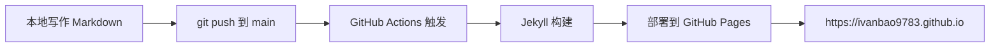

## 你好，世界

这是本站的第一篇文章。本站基于 Jekyll + Chirpy 主题搭建，托管在 GitHub Pages。

## 内容组织验证

这篇文章被打上了：

- **分类**: `技术笔记`
- **标签**: `jekyll`、`chirpy`、`建站`

## Mermaid 图表验证

下面是一个简单的流程图，展示本站的构建与部署流程：

## 排版验证

> 引用块：好的工具让想法流动，而不仅仅是代码流动。

表格示例：

| 功能 | 支持状态 |
|---|---|
| 分类与标签 | ✅ |
| Mermaid 图表 | ✅ |
| Excalidraw 图片 | ✅（后续示例） |
| 深浅色模式 | ✅ |

后续我会在这里持续记录技术笔记、论文解读和项目实践。敬请关注。
