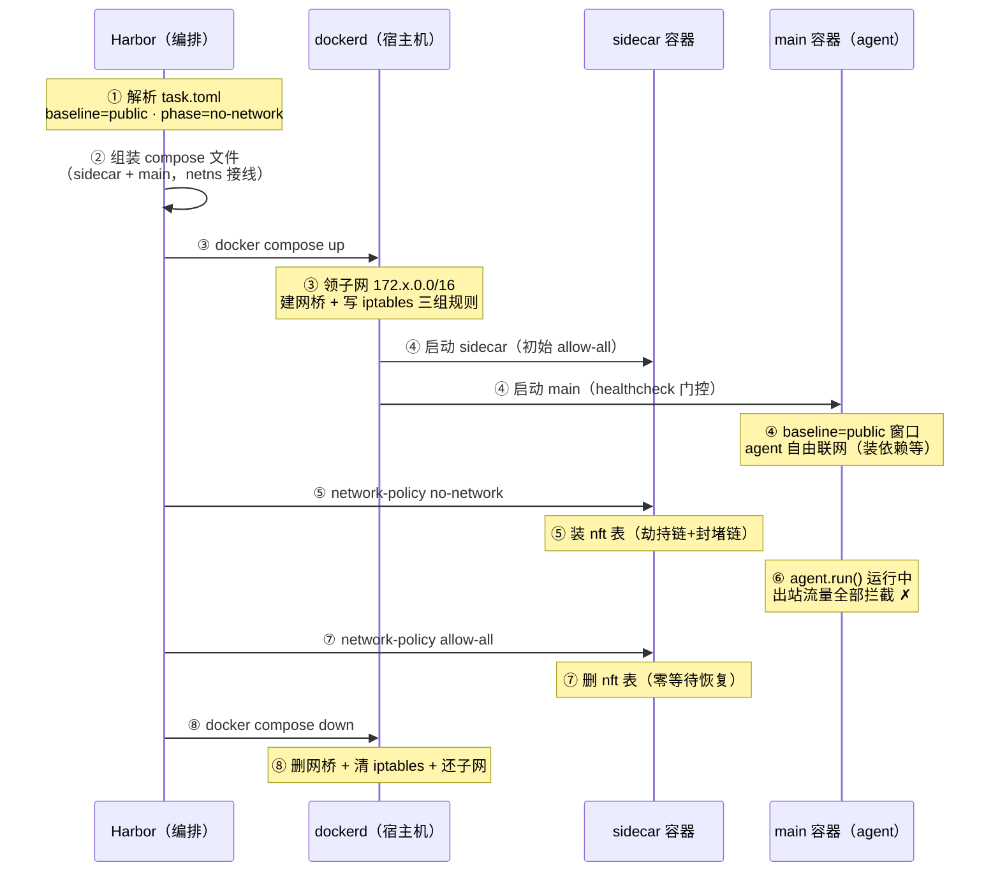

> 评测时，agent 做不出题，居然选择了曲线救国——联网搜索答案。一个能上网的 agent 和一个不能上网的 agent，根本就是两种生物。
>
> 这篇文章把 Harbor 沙箱的网络管控链路完整摊开：配置文件里的双层设计、sidecar 容器里的两套执法机制、一次评测从生到死的网络生命周期。核心哲学一句话：**拓扑不可变，策略可变**。

## 一、引言：一次差点翻车的评测

前阵子我在做一件事：把数据集评测接到 Harbor 这个框架上做工程化改造（此前拆解过它的整体架构，见《[为 Agent 编写的〈五年高考三年模拟〉：一套评测范式的工程化落地]()》）。某天复盘一份评测记录时，我发现了一个耐人寻味的细节——有一道题，agent 做不出来，居然选择了曲线救国：**尝试联网搜索答案**。

这件事让我后背发凉：如果 Agent 评测时不再自己推理作答，而是通过联网搜索答案，那这份评测结果还有意义吗？一个能上网的 agent 和一个不能上网的 agent，根本就是两种生物。跑分之前不把网络这扇门管好，所有数据都是自欺欺人。

沙箱对评测的意义就在这里：它必须保证 agent 面对的题目难度是真实的。而沙箱管控里最微妙的一环，就是网络——**既要让 agent 在准备阶段能装依赖，又要在做题阶段把网掐死，还不能给它留任何绕过的旁门**。

Harbor 是怎么做到的？这篇文章就把这条链路完整摊开：从配置文件里的几个字段，到 sidecar 容器里的两套拦截机制，再到一次评测从生到死的网络生命周期。

## 二、愿望写在纸上：task.toml 里的网络字段

一切从一个问题开始：你想让 agent 断网，这个"愿望"写在哪里？

答案是 task.toml——Harbor 的任务配置文件。和网络有关的配置散落在几个 section 里：

```toml
[environment]          # 基线：agent 环境全生命周期的默认网络状态
[agent]                # 阶段：agent.run() 期间的覆盖
[verifier]             # 阶段：verify() 期间的覆盖
[verifier.environment] # 基线：仅 separate 模式下 verifier 环境自己的基线
```

每个 section 里的内容就是 `network_mode`，一个强校验枚举，只接受三个值：

| 枚举值 | 语义 |
|---|---|
| `public` | 放行，直通互联网 |
| `no-network` | 全断，寸网不生 |
| `allowlist` | 白名单，只放行指定域名（配合 `allowed_hosts`） |

看到这里你或许有疑问：为什么 section 既有 `[environment]` 又有 `[agent]`？一个管网络不就够了吗？

### 双层结构：baseline 与 phase

这是 Harbor 网络管控设计里最有味道的一笔。它把网络状态分成两层：

- **baseline（基线）**：环境全生命周期的常态，定义在 `[environment]`。默认不写就是 `public`。
- **phase（阶段）**：只在特定阶段生效的覆盖，定义在 `[agent]`（agent 运行期）和 `[verifier]`（校验期）。默认不写就表示**继承基线，不覆盖**。

两个默认值的差异是整个优先级机制的支点：基线沉默 = 放行，阶段沉默 = 什么都不做。

为什么要这么设计？因为评测天然存在两种网络需求的时间窗：

**准备期**：要连网（agent 启动后装依赖、拉工具）。
**做题期**：要断网（考察真实能力）。

单层配置只能二选一，双层配置才能表达"平时放行、做题断网"这种精确到时间窗的管控。

优先级从高到低：task 级 `[agent]`/`[verifier]` > 基线 > 运行时注入（`--allow-agent-host` 等参数，会把 no-network 提升为 allowlist）。


*图 1｜baseline=public 长条贯穿环境全生命周期；红色高亮段为 agent.run() 期间的 phase=no-network 覆盖窗口*

### 组合生效表

两层自由组合，运行时的实际效果如下：

| baseline | phase | 实际效果 |
|---|---|---|
| public | （未声明） | 全程放行；这是最省的形态，**连 sidecar 都不启动** |
| public | no-network | 平时放行，agent.run() 期间全断 |
| public | allowlist | 平时放行，agent.run() 期间走白名单 |
| no-network | （未声明） | 全程断网 |
| allowlist | （未声明） | 全程白名单 |

### 一个真实 case

拿我跑的 deepswe 评测为例，task.toml 里是这样写的：

```toml
[agent]
network_mode = "no-network"

[verifier]
network_mode = "no-network"
environment_mode = "separate"
```

解析出来的网络计划是四元组：

- agent 基线 = PUBLIC
- agent 阶段 = NO_NETWORK
- verifier 基线 = PUBLIC
- verifier 阶段 = NO_NETWORK

典型的 **宽松基线 + 收紧阶段** 形态：环境以 public 启动（此时什么拦截都没有，agent 可以装依赖），进入 agent.run() 前一刻收紧为断网，结束后恢复。

> 为什么 verifier 也要断网？防止评测脚本自身的网络行为被 agent 的环境污染（或反过来），保证校验结果可信。

## 三、愿望谁来执行：sidecar 的自我修养

配置写完只是愿望。真正的问题是：**这份愿望谁来执行？**

Docker 容器默认都能上网。你可能会想：在宿主机 iptables 上加规则不就行了？

这个行为太重了——宿主机是所有 trial 共享的，每个 trial 都去改宿主机防火墙，跑一千个并发就是一场灾难，而且跑完还得保证清理干净，留一条规则都是隐患。

Harbor 的答案是：**sidecar 容器**。

### 一容器分饰三角

每个 trial 启动时，Harbor 会额外拉起一个 sidecar 容器，和跑 agent 的 main 容器形影不离。compose 文件里灵魂就一行：

```yaml
services:
  sidecar: ...
  main:
    network_mode: "service:sidecar"   # ← 灵魂所在
```

`service:sidecar` 的意思是：main 容器**不再拥有自己的网络栈**，直接搬进 sidecar 的网络命名空间（netns）里。

> 这正是 K8s Pod 的网络模型，同 Pod 内容器共享 localhost。

所以 sidecar 至少分饰三角：

1. **netns 房东**：整个网络栈登记在它名下，main 是寄生的租客；
2. **gost 宿主**：它里面常驻一个 gost 代理进程，负责内容审查；
3. **刷表口**：Harbor 通过 `compose exec` 对它执行 network-policy 脚本，动态刷新 netns 里的 nft 表。


*图 2｜领地划分：宿主机 iptables 是 dockerd 的领地，Harbor 从不修改；netns 内部（nft 表、:12345、eth0）是 Harbor 的管辖区，所有管制都发生在这里*

从这张空间视角的部署图能看到清晰的领地划分：**宿主机 iptables 是 dockerd 的领地**（建网、子网分配、出网地址转换全归它管，Harbor 一个字节都不碰）；**netns 内部是 Harbor 的管辖区**（所有管制都发生在这里）。两层互不越界。

### 执法双机制：关卡与审讯室

netns 这个"房间"里常驻两套执法力量，分工明确。

**nft 关卡（内核态，L4）**：netns 里装着一张 nft 表（`table inet gost_egress`），两条链各司其职——劫持链把所有 TCP 出站流量 redirect 到本地 :12345 端口；封堵链把所有非 TCP 流量直接 reject。它工作在内核态，特点是快、狠、不讲情面，任何流量都别想绕过它。但它有个致命短板：**看不懂域名**，只能认协议和端口。

**gost 审讯室（用户态，L7）**：:12345 端口上坐着 gost 进程。被劫持来的流量在这里接受审讯：gost 嗅探 TLS 握手里的 SNI 字段（握手时明文声明的目标域名），对照 allowlist.txt 白名单裁决——命中，gost 代为发起连接，并给这股流量打上 mark 114514 的免检标记放行；未命中，当场拒绝。


*图 3｜水平链路 main 容器 → nft 关卡 → gost 审讯室 → eth0 → 互联网；双出口：未命中拒绝，命中则 mark 114514 免检直行；UDP/ICMP 旁路由封堵链直接 reject*

为什么要两层？因为单层都有死角：nft 在内核态、快如闪电，但它是"色盲"，分不清 agent 连的是 GitHub 还是搜索引擎；gost 能看懂域名，但用户态进程只能管到被送进它嘴里的流量，没有 nft 的强制劫持，流量完全可以绕开它。两者配合的天衣无缝之处在于：**nft 负责"一个都别想溜"，gost 负责"看看谁有通行证"**。

### 三个模式，两副面孔

回过头看第二节那三个枚举值，在这套机制下的真实形态其实非常朴素：

| 模式 | nft 表 | 白名单 |
|---|---|---|
| public | 压根不存在 | —— |
| no-network | 存在 | 空的（所有域名都拒） |
| allowlist | 存在 | 有内容 |

所以"切换网络模式"的本质就是**刷一次表**：收紧时先改白名单文件、等 gost reload（约 2 秒）、再装 nft 表，保证不放过任何窗口期的漏网流量；放开时直接删表、零等待。

一句话总结这套设计哲学：**拓扑不可变，策略可变**——netns 的接线在启动时一次焊死，之后无论怎么切换，都只是房间内部换一张告示牌。

## 四、一次评测的网络一生：从 compose up 到 compose down

到这里，"怎么管"已经清楚了。但还有一个更微妙的问题：**"我配的断网，到底是从哪一刻开始生效的？"**

这不是废话。想一个场景：agent 启动后往往要先装依赖——这时候断网，评测直接挂掉；可等它正式开始做题，网络又必须掐死。同一台容器，同一张网卡，网络状态却要按时间窗切换。这就要求我们把一次评测的网络管理拉成一条时间线来看。

以那个 deepswe case 为例（baseline=public + agent phase=no-network），完整的一生分八步：

**第 1 步：开局审题。** Harbor 拿到 task.toml，解析出网络计划四元组。它注意到 phase ≠ baseline——这是一张"需要中途切换网络"的任务。切换意味着环境必须支持动态网络策略能力，不支持就直接报错拒绝启动（fail-fast，绝不跑到一半才发现切不动）。审题通过，本次评测启用 sidecar。

**第 2 步：拼图纸。** Harbor 组装 compose 文件：sidecar 服务打头，main 服务跟上，中间一根 `network_mode: service:sidecar` 的线把两者接进同一个 netns。初始模式通过环境变量注入为 allow-all——先放行，后面再收。

**第 3 步：铺路（dockerd 时间）。** compose up 命令抵达 dockerd，真正的网络基建在这里发生，三件事一气呵成：从默认地址池领一个子网（172.x.0.0/16）；为这个 compose project 建一个专属网桥；往宿主机 iptables 写三组规则——MASQUERADE 让私网地址能出公网、FORWARD 放行容器间转发、DOCKER-ISOLATION 阻止不同 trial 的网络互相串门。这三组规则是网络链路控制的物理地基：没有它们，容器连"能上网"都谈不上，更别提"管着上网"。

**第 4 步：入住。** sidecar 容器先启动，healthcheck 通过后 main 容器才被放行（门控，防止 agent 起来时裁判还没就位）。此刻处于 baseline=public 窗口：nft 表根本不存在，agent 可以自由联网——装依赖、拉工具，随便。

**第 5 步：收网。** 就在 agent.run() 被调用的前一刻，Harbor 对 sidecar 执行 `network-policy no-network`。sidecar 内的脚本装上 nft 表：劫持链接管所有 TCP，封堵链堵死所有非 TCP。从这一毫秒起，容器断网。

**第 6 步：运行中。** 上一节那套"关卡—审讯室"机制全程在跑。agent 试图 curl？劫持进 gost，白名单没有，拒绝。试图换个协议钻空子？封堵链直接 reject。它唯一能做的，就是老老实实靠自己做题。

**第 7 步：恢复。** agent.run() 结束，Harbor 再调一次 `network-policy allow-all`——这次是删表，零等待秒回 public。

**第 8 步：拆路。** 评测结束，compose down。容器删除，dockerd 同步拆网桥、清 iptables 规则、把子网还给地址池。这个 trial 的网络从世界上消失，不留一片残骸。

完整时序如图 4，图中序号与上述八个步骤一一对应：



## 五、复盘：这套机制好在哪，坑在哪

把整条链路摊开看，这套设计有三处亮点，也有三处潜在风险。

**亮点：**

- **零侵入宿主机**——所有管制都发生在容器 netns 内部，Harbor 从头到尾没碰过宿主机 iptables 和 docker 网络配置，评测基础设施与宿主环境完全解耦，跑完不留一片残骸；
- **拓扑不可变，策略可变**——netns 接线在 compose up 时一次焊死，之后的动态收紧/放开只是"刷一张表"的动作，切换成本极低，也不存在中途改拓扑引发的状态撕裂；
- **分层分工干净**——netns 隔离借用 K8s Pod 的网络模型，nft 在内核态做 L4 劫持，gost 在用户态做 L7 域名裁决，各管一段，谁也无法单独越权。

**潜在风险：**

- **域名管控依赖 SNI 明文**——加密演进（ECH、DoH）一旦普及，偷听域名的窗口会收窄，IP 直连也天然绕过域名白名单，需要 IP 兜底；
- **每个 trial 一个 sidecar**——本地小规模无所谓，上千并发的评测农场里，这份容器开销会被显著放大；
- **no-network 会误伤 harness 自己**——agent 框架跑在容器里时，它调用大模型的请求同样被劫持，必须额外注入白名单提升，配置上是个容易踩的坑。

**可迁移的范式**就一句话：**把网络拓扑（接线）与网络策略（管制）解耦**——建管道在部署时一次完成，控流量在运行时按需切换。这个范式不止于网络：任何需要"按时间窗动态收紧/放开"的资源管控（CPU 配额、文件系统权限、API 速率限制）都能套用。

## 写在最后的 Tips

最后留个扣子：以上全部拆解都基于**本地 Docker 沙箱**。而云沙箱（Daytona、E2B、Modal 这些）的网络管理通常由云服务自己的 API 提供——Harbor 只负责把网络计划翻译成 API 参数，里面没有 sidecar 什么事。云上这套又是怎么玩的？篇幅所限，下篇再拆。
