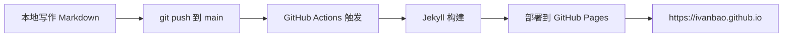

# 个人网站搭建 Implementation Plan

> **For agentic workers:** REQUIRED SUB-SKILL: Use superpowers:subagent-driven-development (recommended) or superpowers:executing-plans to implement this plan task-by-task. Steps use checkbox (`- [ ]`) syntax for tracking.

**Goal:** 将空的 `ivanbao.github.io` 仓库搭建为基于 Jekyll + Chirpy 主题的个人博客站点，支持分类/标签组织和 mermaid 图表，通过 GitHub Actions 自动部署。

**Architecture:** 使用 Chirpy Starter 模板（starter 分支）引入项目骨架，配置 `_config.yml` 定制站点元信息，通过 GitHub Actions workflow 自动构建并部署到 GitHub Pages。本地通过 `bundle exec jekyll s` 预览。

**Tech Stack:** Jekyll 4.x、Chirpy 主题（gem 形式）、Ruby 3.x + Bundler、Node.js（mermaid 工具链）、GitHub Actions。

**对应 Spec:** [docs/specs/2026-08-19-personal-site-design.md](../specs/2026-08-19-personal-site-design.md)

---

## File Structure

本计划将创建或修改以下文件：

| 路径 | 责任 | 操作 |
|---|---|---|
| `_config.yml` | 站点全局配置（标题、URL、作者、语言等） | Chirpy 模板自带，修改 |
| `.github/workflows/pages-deploy.yml` | GitHub Actions 自动部署工作流 | Chirpy 模板自带，核对 |
| `_tabs/about.md` | 关于页内容 | Chirpy 模板自带，修改 |
| `_posts/2026-08-19-welcome-to-jekyll.md` | 示例文章（验证分类/标签/mermaid） | 新建 |
| `Gemfile.lock` | Ruby 依赖锁文件 | `bundle install` 自动生成 |
| `README.md` | 仓库说明 | 修改 |
| `docs/specs/2026-08-19-personal-site-design.md` | 设计 spec | 已存在 |

Chirpy 模板还会自带 `_data/`、`_plugins/`、`assets/`、`tools/`、`package.json`、`.gitignore` 等文件，保持原样不改动。

---

## Task 0: 安装 Ruby 工具链（前置条件）

**说明:** Chirpy 需要 Ruby 3.x + Bundler。当前环境已有 Node.js v24.15.0，但 Ruby 未安装。本任务确保工具链就绪。

**验证当前状态:**
- Node.js v24.15.0 ✅ 已安装
- Ruby ❌ 未安装
- Bundler ❌ 未安装

- [ ] **Step 1: 检查 winget 是否可用**

Run: `winget --version`
Expected: 输出版本号（如 `v1.x.x`）。如果报错，转 Step 2 手动安装。

- [ ] **Step 2a: 通过 winget 安装 Ruby（推荐）**

Run: `winget install RubyInstallerTeam.Ruby.3.3`
Expected: 安装成功，提示已安装路径。安装后**关闭并重新打开终端**以刷新 PATH。

- [ ] **Step 2b（备选）: 手动安装 Ruby**

如果 winget 不可用：
1. 访问 https://rubyinstaller.org/downloads/
2. 下载 RubyInstaller 3.3.x (x64) with Devkit
3. 运行安装程序，勾选 "Add Ruby executables to your PATH"
4. 完成安装后重启终端

- [ ] **Step 3: 验证 Ruby 已安装**

Run: `ruby --version`
Expected: `ruby 3.3.x`

- [ ] **Step 4: 安装 Bundler**

Run: `gem install bundler`
Expected: 输出 `Successfully installed bundler x.x.x`

- [ ] **Step 5: 验证 Bundler 已安装**

Run: `bundle --version`
Expected: `Bundler version x.x.x`

- [ ] **Step 6: 本步骤无需提交（环境配置）**

---

## Task 1: 引入 Chirpy Starter 模板

**目标:** 将 Chirpy Starter 分支的文件合并到当前仓库，作为项目骨架。

**Files:**
- Create: 由模板引入的全部骨架文件（`_config.yml`, `Gemfile`, `package.json`, `_tabs/`, `.github/workflows/`, `tools/`, `assets/`, `_data/`, `_plugins/` 等）

- [ ] **Step 1: 添加 Chirpy 仓库作为临时远程**

Run: `git remote add chirpy https://github.com/cotes2020/jekyll-theme-chirpy.git`
Expected: 无输出（成功）

- [ ] **Step 2: 拉取 starter 分支**

Run: `git fetch chirpy starter`
Expected: 输出拉取进度，无错误

- [ ] **Step 3: 将 starter 分支的文件检出到工作区（保留 docs/ 与 README.md）**

Run: `git checkout chirpy/starter -- _config.yml _data _plugins _posts _tabs Gemfile LICENSE package.json purgecss.js tools .github .gitignore`
Expected: 无输出，工作区出现这些文件/目录

**注意:** 不检出 starter 的 `README.md` 和 `docs/`，避免覆盖我们已有的内容。如果 starter 分支还有其他必要文件（如 `_config.yml` 引用的资源），一并加入路径列表。

- [ ] **Step 4: 移除临时远程**

Run: `git remote remove chirpy`
Expected: 无输出（成功）

- [ ] **Step 5: 查看引入的文件结构，确认完整**

Run: `git status`
Expected: 显示新增的未跟踪文件（_config.yml, Gemfile, _tabs/ 等）

- [ ] **Step 6: 暂存并提交骨架**

Run: `git add _config.yml _data _plugins _posts _tabs Gemfile LICENSE package.json purgecss.js tools .github .gitignore`
Run: `git commit -m "chore: bootstrap Chirpy starter template"`
Expected: 提交成功，显示新增文件数量

---

## Task 2: 配置 _config.yml 定制站点信息

**目标:** 修改 Chirpy 默认配置，适配个人站点（中文、时区、域名等）。

**Files:**
- Modify: `_config.yml`

- [ ] **Step 1: 查看当前 _config.yml 默认内容**

Run: `Get-Content _config.yml -TotalCount 50`
Expected: 显示 Chirpy 默认配置，包含 `title`、`url`、`avatar` 等字段

- [ ] **Step 2: 修改站点标题、副标题、描述**

在 `_config.yml` 中找到以下字段并修改：

```yaml
title: ivanbao                           # 站点标题
subtitle: 个人博客                        # 副标题
description: >-                          # 站点描述（用于 SEO）
  ivanbao 的个人博客，记录技术与思考。
```

- [ ] **Step 3: 修改 url 和 baseurl**

```yaml
url: https://ivanbao.github.io           # 生产域名
baseurl: ""                              # 用户站点根路径，留空
```

- [ ] **Step 4: 修改时区、语言**

```yaml
timezone: Asia/Shanghai                  # 时区
lang: zh-CN                              # 默认语言
```

- [ ] **Step 5: 配置 author 信息**

```yaml
author: ivanbao
```

- [ ] **Step 6: 确认主题模式（深浅色）**

```yaml
theme_mode: auto                         # 跟随系统
```

- [ ] **Step 7: 验证配置语法正确**

Run: `bundle exec jekyll --version`（仅验证 Ruby/Jekyll 可解析，即使未 install 依赖，也会报缺失依赖错误，但不应有 YAML 语法错误）
Expected: 报错仅关于缺依赖（如 `Could not find gem 'jekyll'`），无 YAML 解析错误

- [ ] **Step 8: 提交配置修改**

Run: `git add _config.yml`
Run: `git commit -m "config: set site title, url, timezone, and language"`
Expected: 提交成功

---

## Task 3: 核对 GitHub Actions 部署工作流

**目标:** 确认 `.github/workflows/pages-deploy.yml` 可用于自动部署，无需修改。

**Files:**
- Read/verify: `.github/workflows/pages-deploy.yml`

- [ ] **Step 1: 查看工作流文件**

Run: `Get-Content .github/workflows/pages-deploy.yml`
Expected: 显示工作流定义，包含 `on: push` 触发、`build` job、`actions/deploy-pages` 步骤

- [ ] **Step 2: 确认触发分支为 main**

工作流中的 `on.push.branches` 应为 `[main]`。如果当前主分支名为 `master`，需要：
- 改工作流：将 `branches: [main]` 改为 `branches: [master]`
- 或重命名本地分支：`git branch -m master main` + 推送

Run: `git branch --show-current`
Expected: 显示当前主分支名

- [ ] **Step 3: 无需修改则直接提交（如有调整）**

Run: `git add .github/workflows/pages-deploy.yml`
Run: `git commit -m "ci: align deploy workflow trigger with main branch"`（仅当有修改时）
Expected: 提交成功或无改动

---

## Task 4: 定制关于页内容

**目标:** 修改 Chirpy 默认的关于页，写为个人简介。

**Files:**
- Modify: `_tabs/about.md`

- [ ] **Step 1: 查看默认 about.md**

Run: `Get-Content _tabs/about.md`
Expected: 显示默认内容，front matter 含 `title: About` 和 `icon: fas fa-info-circle`

- [ ] **Step 2: 替换 about.md 正文为个人简介**

将 `_tabs/about.md` 正文部分替换为（保留 front matter）：

```markdown
## 关于我

你好，我是 ivanbao。这里是我在互联网上的个人角落，记录技术笔记、阅读思考与项目实践。

## 本站内容

- **技术笔记**: 工程实践、工具使用、踩坑记录
- **论文解读**: 学术论文阅读笔记与批判性思考
- **项目记录**: 个人项目的设计与实现

## 联系方式

- GitHub: [@ivanbao](https://github.com/ivanbao)
```

- [ ] **Step 3: 提交关于页修改**

Run: `git add _tabs/about.md`
Run: `git commit -m "content: write personal about page"`
Expected: 提交成功

---

## Task 5: 创建示例文章验证内容组织与 mermaid

**目标:** 写一篇示例博文，验证 front matter（分类/标签）、mermaid 渲染、图片引用约定都能正常工作。

**Files:**
- Create: `_posts/2026-08-19-welcome-to-jekyll.md`
- Create: `assets/img/posts/2026-08-19/welcome.png`（可选，跳过若无素材）

- [ ] **Step 1: 确保文章目录存在**

Run: `New-Item -ItemType Directory -Force -Path _posts`
Run: `New-Item -ItemType Directory -Force -Path assets/img/posts/2026-08-19`
Expected: 目录就绪（若已存在会跳过创建）

- [ ] **Step 2: 创建示例文章**

写入文件 `_posts/2026-08-19-welcome-to-jekyll.md`，完整内容如下：

```markdown
---
title: 欢迎来到我的博客
author: ivanbao
date: 2026-08-19 14:00:00 +0800
categories: [技术笔记]
tags: [jekyll, chirpy, 建站]
description: 这是一篇示例文章，用于验证分类、标签、mermaid 图表和图片引用都能正常工作。
mermaid: true
---

## 你好，世界

这是本站的第一篇文章。本站基于 Jekyll + Chirpy 主题搭建，托管在 GitHub Pages。

## 内容组织验证

这篇文章被打上了：

- **分类**: `技术笔记`
- **标签**: `jekyll`、`chirpy`、`建站`

## Mermaid 图表验证

下面是一个简单的流程图，展示本站的构建与部署流程：



## 排版验证

> 引用块：好的工具让想法流动，而不仅仅是代码流动。

表格示例：

| 功能 | 支持状态 |
|---|---|
| 分类与标签 | ✅ |
| Mermaid 图表 | ✅ |
| Excalidraw 图片 | ✅（后续示例） |
| 深浅色模式 | ✅ |

后续我会在这里持续记录技术笔记、论文解读和项目实践。敬请关注。
```

- [ ] **Step 3: 提交示例文章**

Run: `git add _posts/2026-08-19-welcome-to-jekyll.md`
Run: `git commit -m "content: add welcome post to verify categories, tags, and mermaid"`
Expected: 提交成功

---

## Task 6: 安装依赖并本地预览

**目标:** 安装 Ruby 依赖，启动本地预览服务器，验证站点能正常构建和访问。

**Files:**
- Create: `Gemfile.lock`（由 `bundle install` 自动生成）

- [ ] **Step 1: 安装 Ruby 依赖**

Run: `bundle install`
Expected: 输出安装进度，结尾显示 `Bundle complete! N gemfile dependencies, M gems now installed.` 若有 native extension 编译可能耗时数分钟。

- [ ] **Step 2: 启动本地 Jekyll 服务器**

Run: `bundle exec jekyll s`
Expected: 输出 `Server address: http://127.0.0.1:4000`，无构建错误。此命令会阻塞终端。

- [ ] **Step 3: 在浏览器验证站点**

访问 `http://127.0.0.1:4000`
Expected:
- 首页显示站点标题 `ivanbao`
- 左侧导航含 About、Archives、Categories
- 首页文章列表显示「欢迎来到我的博客」
- 点进文章，能看到 mermaid 流程图正确渲染
- 切换深/浅色模式正常

- [ ] **Step 4: 停止本地服务器**

在运行 `jekyll s` 的终端按 `Ctrl+C`
Expected: 服务器停止

- [ ] **Step 5: 提交 Gemfile.lock**

Run: `git add Gemfile.lock`
Run: `git commit -m "build: lock Ruby gem dependencies"`
Expected: 提交成功

---

## Task 7: 推送并验证 GitHub Pages 部署

**目标:** 推送代码到 GitHub，触发 Actions 自动部署，验证线上站点可访问。

**Files:** 无新文件

- [ ] **Step 1: 确认远程仓库配置**

Run: `git remote -v`
Expected: 显示 `origin` 指向 `https://github.com/ivanbao/ivanbao.github.io.git`（或 SSH 形式）。若无 origin，需先 `git remote add origin <仓库URL>`

- [ ] **Step 2: 推送到 main 分支**

Run: `git push -u origin main`
Expected: 推送成功（首次会提示设置 upstream）

- [ ] **Step 3: 在 GitHub 仓库 Settings 配置 Pages Source**

访问 `https://github.com/ivanbao/ivanbao.github.io/settings/pages`
- 找到 "Build and deployment" → "Source"
- 选择 **GitHub Actions**（而非 "Deploy from a branch"）
Expected: 设置已保存

- [ ] **Step 4: 查看 GitHub Actions 运行状态**

访问 `https://github.com/ivanbao/ivanbao.github.io/actions`
Expected: 看到 "Build and Deploy" workflow 正在运行或已完成（绿色对勾）

- [ ] **Step 5: 验证线上站点**

等待 Actions 完成后，访问 `https://ivanbao.github.io`
Expected:
- 站点首页加载正常
- 文章「欢迎来到我的博客」可见
- mermaid 图表在线上也能正确渲染
- 关于页可访问

- [ ] **Step 6: 本地拉取确认远程状态一致**

Run: `git pull --rebase`
Expected: `Already up to date.` 或快进更新

---

## 验收清单（对应 Spec 第 6 节）

- [ ] 仓库初始化为 Chirpy Starter 模板结构（Task 1）
- [ ] `_config.yml` 配置完成（Task 2）
- [ ] `.github/workflows/pages-deploy.yml` 就绪（Task 3）
- [ ] 本地 `bundle exec jekyll s` 能正常预览（Task 6）
- [ ] 推送到 main 分支后 GitHub Actions 自动构建部署成功（Task 7）
- [ ] 访问 `https://ivanbao.github.io` 显示站点首页（Task 7）
- [ ] 示例文章正确展示分类、标签、mermaid 图表（Task 5 + Task 7）

---

## 自查记录

- **Spec 覆盖**: 所有 spec 第 6 节验收标准均映射到具体 Task。
- **占位符扫描**: 无 TBD/TODO。
- **类型一致性**: 文件路径在所有 Task 中一致（`_posts/`, `_tabs/about.md`, `_config.yml`, `.github/workflows/pages-deploy.yml`）。
